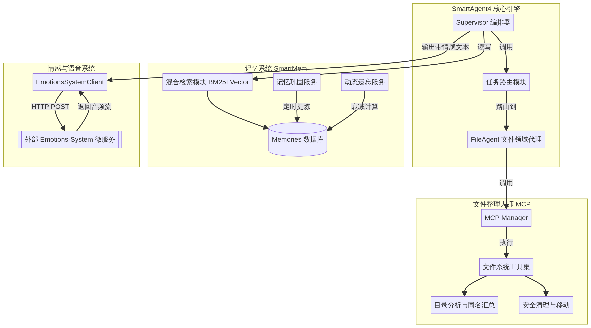

# SmartAgent4 系统架构设计

**文档状态**：第2阶段产出
**目标**：定义 SmartAgent4 的高层系统架构，特别是针对 SmartMem 记忆系统、Emotions-System TTS 语音合成以及文件整理大师三大新增功能的集成设计。

## 1. 高层架构图

SmartAgent4 在保留 SmartAgent3 核心 Supervisor-Worker 架构的基础上，横向扩展了记忆、情感和文件处理能力。

## 2. 模块职责说明

| 模块名称 | 主要职责 | 技术栈与依赖 |
| :--- | :--- | :--- |
| **Agent 核心引擎** | 负责对话编排、意图分类、任务路由和领域 Agent（如 FileAgent）的调度。 | TypeScript, LangGraph 概念, LLM (ByteDance) |
| **记忆系统 (SmartMem)** | 提供长短期记忆的存储、混合检索（BM25+Vector）、记忆巩固（聚类提炼）和动态遗忘（指数衰减）。 | TypeScript, Drizzle ORM, SQLite/PostgreSQL |
| **情感与语音系统** | 解析 LLM 输出的复合情感标签，调用外部 TTS 微服务生成音频，并组装多模态响应。 | TypeScript (Client), Python (外部微服务) |
| **文件整理大师 (MCP)** | 提供高级文件系统操作，包括目录分析、同名文件汇总、重复检测、安全删除和移动。 | TypeScript, Node.js `fs` 模块, MCP 协议 |

## 3. 核心数据流描述

### 3.1 记忆写入与巩固数据流
1.  **写入**：用户与 Agent 交互时，`memoryExtractionNode` 提取关键信息，调用 `memorySystem.ts` 写入 `memories` 表，同时计算 Embedding 并初始化重要性分数。
2.  **巩固**：后台定时任务（Cron）触发 `ConsolidationService`，查询近期高频访问的零散记忆，调用 LLM 进行聚类和提炼，生成高阶语义记忆并存入数据库。
3.  **遗忘**：后台定时任务触发 `ForgettingService`，根据艾宾浩斯遗忘曲线公式（$R = e^{-t/S}$）衰减记忆重要性分数。

### 3.2 情感语音合成数据流
1.  **生成**：LLM 根据上下文生成带有复合情感标签的文本，例如 `[emotion:happy|instruction:用欢快的语气] 好的，我帮你整理文件！`。
2.  **解析与调用**：`EmotionsSystemClient` 拦截该文本，使用正则提取标签和纯文本，通过 HTTP POST 请求发送给外部的 Emotions-System 微服务。
3.  **组装**：微服务返回 WAV 音频流（或 Base64），Client 将其与纯文本打包成 `MultimodalSegment` 返回给前端播放。

### 3.3 文件整理与清理数据流（交互式）
1.  **分析**：用户请求“整理下载目录”。`TaskRouter` 将任务路由给 `FileAgent`。`FileAgent` 调用 MCP 工具 `analyze_directory` 和 `find_duplicates`。
2.  **展示**：MCP Server 扫描本地文件系统，返回同名文件列表、大文件列表和统计数据。`FileAgent` 将这些数据格式化后展示给用户，并提出清理建议。
3.  **确认与执行**：用户在前端确认删除某些文件。`FileAgent` 接收到确认指令后，调用 MCP 工具 `delete_files`（移入回收站或直接删除），并向用户报告清理结果。

## 4. 关键设计决策

### 4.1 记忆系统的内嵌而非独立服务
*   **背景**：SmartMem 原本是一个独立项目。
*   **决策**：将其核心算法（混合检索、巩固、遗忘）直接内嵌到 SmartAgent4 的 `server/memory` 目录中，并复用现有的 Drizzle ORM 数据库连接。
*   **理由**：减少微服务间的网络开销，且记忆数据与 Agent 的上下文高度耦合，内嵌能提供最佳的性能和开发体验。

### 4.2 文件清理的“强制确认”机制
*   **背景**：赋予 AI 删除本地文件的能力存在极高的安全风险。
*   **决策**：在 `FileAgent` 的系统提示词中硬编码“强制确认”规则，并在 MCP Server 的 `delete_files` 工具实现中加入路径白名单校验（仅限用户目录）。
*   **理由**：确保用户对破坏性操作拥有绝对的控制权，防止 AI 误删系统关键文件。

### 4.3 语音合成的微服务解耦
*   **背景**：Emotions-System 依赖 Python 和特定的 AI SDK。
*   **决策**：SmartAgent4 仅实现一个轻量级的 HTTP 客户端，将 TTS 核心逻辑完全交给外部独立部署的 Emotions-System。
*   **理由**：避免在 TypeScript 项目中混入复杂的 Python 依赖，保持核心系统的纯粹性。
