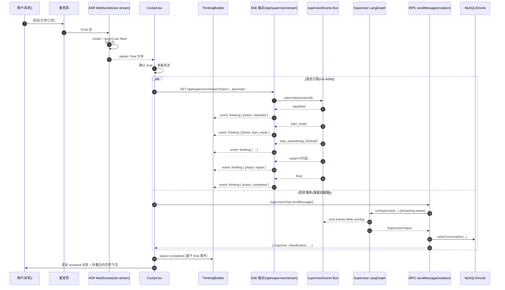

# SmartAgent4 v0.5 架构与设计（第 2 阶段交付物）

**作者**：Manus Agent
**日期**：2026-04-24
**对应阶段**：system-dev v0.8 第 2 阶段
**前置文档**：`REPO_ANALYSIS_V0.5.md`

---

## 1. 设计目标与原则

### 1.1 目标
1. 为方言 ASR、半身 AIRI、可视化思考气泡、Supervisor 流式事件四项改动提供**自洽且最小侵入**的架构设计。
2. 保证现有 `runSupervisor` / `chat.sendMessage` mutation 在新链路上线后**仍可正常工作**（双轨并存、回退安全）。
3. 让"思考事件"具备**端到端可订阅**的传输通道（后端 emit → 网关广播 → 前端订阅 → UI 渲染）。

### 1.2 设计原则
- **不动 Supervisor 业务逻辑**：复用 `compiled.streamEvents()` / `compiled.stream(...)`，避免改 `classifyNode / planNode / executeNode / replanNode` 的内部实现。
- **不动 tRPC 客户端 link**：当前 `main.tsx` 仅装 `httpBatchLink`，引入 `httpSubscriptionLink` 会牵连测试与超时配置；选择**独立 SSE 端点 + 原生 EventSource**，与 tRPC mutation 解耦。
- **共享类型先行**：所有跨进程数据形状先在 `shared/` 落地，前后端各自 import，杜绝两端各自定义 DTO。
- **向后兼容**：`AiriStageContainer` 默认 `viewMode = "fullBody"`，旧调用方零改动；ASR 默认值升级但保留环境变量回退。

---

## 2. v0.5 整体数据流（变更后）



> 关键：mutation 发送的同时建立 SSE 订阅，二者通过 `requestId` 关联；Supervisor 在执行过程中通过事件总线把节点过渡向所有订阅者广播。SSE 与 mutation 的最终状态都到达后，前端做幂等合并。

---

## 3. 模块视角的变更点

### 3.1 后端

| 模块 | 文件 | 变更 |
|---|---|---|
| ASR | `server/asr/asrStreamSocket.ts` | `DEFAULT_MODEL` 由 `fun-asr-realtime` 改为 `qwen3-asr-flash`；保留 `process.env.DASHSCOPE_ASR_MODEL` 覆盖；`buildRunTaskMessage` 在新模型下追加 `parameters.language_hints` 默认值 `["zh"]` |
| Supervisor 事件总线 | **新增** `server/agent/supervisor/supervisorEvents.ts` | 定义 `SupervisorEvent` 联合类型 + 进程内 `EventEmitter` 单例（`eventBus`） + 带 `requestId` 的 publish/subscribe API |
| Supervisor 流式入口 | `server/agent/supervisor/supervisorGraph.ts` | 新增 `runSupervisorStreaming(input, agentSource, onEvent)`：内部基于 `compiled.streamEvents()` 监听 `on_chain_start / on_chain_end` 与节点名映射为 `SupervisorEvent`；不改原 `runSupervisor` |
| SmartAgentApp | `server/agent/smartAgentApp.ts` | 新增 `chatStreaming(message, options, onEvent)`，复用 `traceable` 包装；`chat()` 不变 |
| tRPC 路由 | `server/routers/supervisorChatRouter.ts` | `sendMessage` mutation 不变；新增可选 `requestId` 字段，启用时执行 `chatStreaming` 并把事件 `eventBus.publish(requestId, evt)` |
| SSE 端点 | **新增** `server/_core/supervisorStream.ts` + 在 `server/_core/index.ts` 注册 `app.get("/api/supervisor/stream", ...)` | 接收 `requestId` query，经 `eventBus.subscribe` 订阅事件，使用 `text/event-stream` 推送；连接断开/超时自动清理 |

> SSE 选型理由：当前 tRPC 客户端仅挂 `httpBatchLink`，新增 `httpSubscriptionLink` 会改动 `main.tsx`、`vite` 代理、测试桩等多处；而 Express 已经在用，新增 1 个 GET 端点 + 前端 1 个 `EventSource` 即可，**侵入面 ≤ 4 行 main.tsx 不变**。

### 3.2 前端

| 模块 | 文件 | 变更 |
|---|---|---|
| 共享类型 | `shared/chatTts.ts` | 新增 `ChatThinkingPhase`、`ChatThinkingDetail`、`ChatUiThinkingMessage`；将 `ChatUiMessage` 升级为 `user / assistant / thinking` 联合类型 |
| 共享事件类型 | **新增** `shared/supervisorEvents.ts` | 定义与后端一致的 `SupervisorEvent`、`ThinkingPhase`、`SupervisorEventEnvelope` |
| 思考气泡 | **新增** `client/src/components/cockpit/ThinkingBubble.tsx` | props：`message: ChatUiThinkingMessage`，三态 UI：`pending / running / completed`；折叠态文案以 "Metris Agent 思考中..." 起头 |
| AssistantPanel | `client/src/components/cockpit/AssistantPanel.tsx` | 渲染 `thinking` 角色时跳过 `AssistantMessage / UserMessage`，改用 `ThinkingBubble` |
| AIChatBox | `client/src/components/AIChatBox.tsx` | `Message` 类型扩展 `thinking`；过滤 `system` 同时正确渲染 thinking 角色（fallback 灰色卡片） |
| Stage 半身 | `client/src/components/airi-stage/AiriStageContainer.tsx` | 新增 `viewMode?: "fullBody" \| "halfBody"`、`framingRatio?: number` 两个 prop；`initStage` 与 `handleResize` 内的 `scaleVal / model.y` 抽出 `computeFraming(viewMode, width, height, baseScale)` 工具函数 |
| Cockpit | `client/src/pages/Cockpit.tsx` | ① 默认 `<AiriStageContainer viewMode="halfBody" />`（仅在 `arkDirectMode === false` 时生效）；② 发送消息时生成 `requestId = crypto.randomUUID()`，先打开 `EventSource` 再调用 mutation；③ 流事件 reducer 同步维护 `messages: ChatUiMessage[]` |
| Hook | **新增** `client/src/hooks/useSupervisorStream.ts` | 封装 `EventSource` 生命周期、错误重连、final 事件后的清理，对外暴露 `start(requestId) / events / close()` |

### 3.3 共享

| 文件 | 变更 |
|---|---|
| `shared/chatTts.ts` | 联合类型扩展（向后兼容现有 `assistant/user`） |
| `shared/supervisorEvents.ts`（新增） | 与后端一致的 SupervisorEvent 定义 |

---

## 4. 关键架构决策（ADR-lite）

### ADR-1：为何用独立 SSE 而不是 tRPC subscription
- **现状**：`@trpc/client@11` subscription 需要 `httpSubscriptionLink` 或 WebSocket，改动会牵连 `main.tsx`、Vite dev 代理、测试 `setup` 文件。
- **选项 A**：升级 tRPC link，统一所有传输 → 侵入面大、对 query/mutation 行为可能产生回归。
- **选项 B（采纳）**：新增 1 个 Express SSE 端点 + 前端 `EventSource`，与 tRPC 链路解耦；`requestId` 作为关联键。
- **代价**：CSRF/鉴权需要复用 cookie（已 `credentials: "include"`），SSE 端点需要做与 tRPC 相同的 `protectedProcedure` 鉴权 → 通过抽出 `ensureUser(req)` middleware 复用现有逻辑。

### ADR-2：是否新增 `ChatUiMessage.role = "thinking"`
- **选项 A**：在 `assistant` 上挂可选 `thinking` 字段。问题：`ChatUiMessage[]` 顺序与可视化时间轴不匹配（思考气泡需要先出现、后被收起）。
- **选项 B（采纳）**：把 `thinking` 提升为顶级 role，最大化简化 UI 渲染逻辑（`map` 时按 role 分发组件即可）；`AIChatBox` 与 `AssistantPanel` 各自适配。

### ADR-3：viewMode 写在 props 还是 store
- **采纳**：`viewMode` 走 props（默认 `fullBody`），保持 `useStageStore.config` 不变；后续若需要全局动效（例如自动从 fullBody 缩入 halfBody），再升级到 store。
- **理由**：当前唯一调用方 `Cockpit.tsx` 直接选择，过早抽象会让 store schema 抖动。

### ADR-4：Supervisor 事件总线放在进程内 vs Redis
- **采纳**：进程内 `EventEmitter`（单实例 SmartAgentApp）。Demo 与开发环境均为单进程；多副本场景下需要切换为 Redis pub/sub 或 NATS，标注在风险登记中。

---

## 5. 组件依赖图

```mermaid
flowchart LR
  subgraph Client[Client (React + Vite)]
    Cockpit -->|EventSource| useSupervisorStream
    Cockpit -->|tRPC mutation| TrpcClient
    Cockpit --> AssistantPanel
    AssistantPanel --> ThinkingBubble
    AssistantPanel --> AssistantMessage
    AssistantPanel --> UserMessage
    Cockpit --> AiriStageContainer
    AiriStageContainer -->|computeFraming| FramingUtil
  end

  subgraph Shared[shared/]
    chatTts[chatTts.ts]
    supEvents[supervisorEvents.ts]
  end

  subgraph Server[Server (Node + tRPC + Express)]
    Express -->|/api/trpc| TRPC[supervisorChatRouter]
    Express -->|/api/supervisor/stream| SSEEndpoint
    SSEEndpoint --> EventBus
    TRPC --> SmartAgentApp
    SmartAgentApp -->|runSupervisorStreaming| SupervisorGraph
    SupervisorGraph -->|streamEvents| LangGraph
    SmartAgentApp --> EventBus
    AsrSocket[asrStreamSocket.ts]
    SupervisorGraph -.-> EventBus
  end

  Cockpit --- chatTts
  ThinkingBubble --- chatTts
  useSupervisorStream --- supEvents
  EventBus --- supEvents
```

---

## 6. 风险与缓解

| ID | 风险 | 影响 | 缓解 |
|---|---|---|---|
| R1 | `streamEvents()` 在 LangGraph v1.2 中事件命名可能不稳 | 思考气泡丢事件 | 在 `supervisorEvents.ts` 设白名单；未匹配事件作为 `info` 级日志，UI 不阻塞 |
| R2 | SSE 在某些代理/防火墙下被缓冲 | 思考气泡延迟出现 | 端点设置 `X-Accel-Buffering: no` 与每 15s 心跳 `:keep-alive` |
| R3 | mutation 与 SSE 顺序竞争（mutation 早于 final 事件返回） | UI 看到答案但思考气泡仍 running | 前端 reducer 以"两路任一到达 final 即合并"，且 final 事件携带 `response` 用于校验 |
| R4 | 沙箱无 Live2D 资源 | halfBody UI 无法肉眼验证 | 提供 `framing.test.ts` 做几何参数断言；截图用 `enabled=false` 占位 + 假 PIXI 不阻塞验证 |
| R5 | `chat.test.ts` 仍因 MySQL 失败 | 影响 CI 信心 | 在 TESTING.md 标注遗留；本次不修复，仅承诺新增改动不引入 DB 依赖 |

---

## 7. 验收门（DoD）

进入第 3 阶段前，本架构需满足：
- [x] 数据流图覆盖全部 7 个用户故事
- [x] 每个变更点列出具体文件与操作
- [x] ADR 解释 SSE / 共享类型 / Stage props / 事件总线四项关键决策
- [x] 风险登记包含传输、网络、UI、CI 四个层面
- [ ] 用户在检查点 2 确认（待用户回复）
