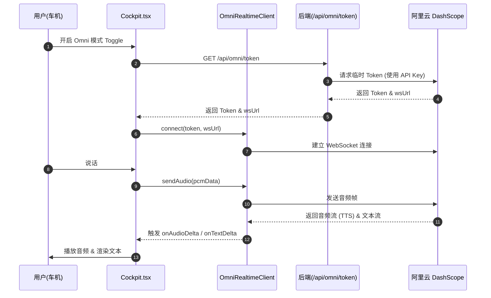

# SmartAgent4 v0.5 第二批迭代 — 架构与设计

**作者**：Manus AI
**日期**：2026-04-25
**对应阶段**：system-dev v0.8 第 2 阶段
**前置文档**：`REPO_ANALYSIS_V0.5_BATCH2.md`

---

## 1. 设计目标与原则

### 1.1 目标
1. 为 Omni 端到端语音、新闻助理、飞书协同、行程规划、订餐服务、跨域协同等 6 大核心业务场景提供架构设计。
2. 确保新增的 Agent 和工具完全遵循现有的 Agent Card 注册机制和 Supervisor 路由机制。
3. 确保 Omni 模式的 WebSocket 链路与现有的 tRPC/SSE 链路解耦，实现优雅降级。

### 1.2 设计原则
- **复用现有基础设施**：新增 Agent 必须继承 `BaseAgent`，新增工具必须通过 `ToolRegistry` 注册，复用现有的记忆系统和 MCP 框架。
- **配置驱动路由**：通过新增 Agent Card JSON 文件，让 `DynamicPromptAssembler` 自动感知新领域，不硬编码路由逻辑。
- **防御性设计**：在跨域协同场景中，通过 System Prompt 注入明确的上下文约束，防止 LLM 产生幻觉或遗漏关键参数。
- **前后端分离的 Omni 架构**：后端仅负责 Token 签发，前端直接与 DashScope 建立 WebSocket 连接，降低后端带宽压力并实现最低延迟。

---

## 2. 整体数据流（第二批迭代新增）

### 2.1 Omni 模式数据流



### 2.2 跨域协同数据流（行程 + 飞书）

```mermaid
sequenceDiagram
  autonumber
  participant U as 用户
  participant Sup as Supervisor
  participant Nav as NavigationAgent
  participant Off as OfficeAgent
  participant Amap as 高德 MCP
  participant Lark as 飞书 MCP

  U->>Sup: "规划上海行程并飞书拉群"
  Sup->>Sup: classifyNode 识别为 cross_domain
  Sup->>Sup: planNode 生成 2 步计划
  
  Sup->>Nav: 执行步骤 1 (依赖: 无)
  Nav->>Amap: 调用 generate_itinerary
  Amap-->>Nav: 返回行程数据
  Nav-->>Sup: 返回 stepResult (包含行程 JSON)
  
  Sup->>Off: 执行步骤 2 (依赖: 步骤 1)
  Note over Off: System Prompt 强制要求<br/>提取前置行程作为消息正文
  Off->>Lark: 调用 lark_im_create_chat
  Lark-->>Off: 返回 chatId
  Off->>Lark: 调用 lark_im_send_message (包含行程)
  Lark-->>Off: 返回发送成功
  Off-->>Sup: 返回 stepResult
  
  Sup->>U: 汇总结果，前端渲染时间轴与飞书通知
```

---

## 3. 模块职责表

### 3.1 后端新增模块

| 模块 | 文件路径 | 职责描述 | 依赖 |
|------|----------|----------|------|
| **Omni Token 路由** | `server/omni/omniTokenRouter.ts` | 提供获取 DashScope 临时 Token 的接口，保护 API Key 不泄露 | `axios`, `express` |
| **新闻工具** | `server/agent/tools/newsTools.ts` | 提供 `get_latest_news` Mock 工具，支持按分类获取新闻 | `ToolRegistry` |
| **行程工具** | `server/agent/tools/itineraryTools.ts` | 提供 `generate_itinerary` 工具，生成结构化行程数据 | `ToolRegistry` |
| **生活服务工具** | `server/agent/tools/serviceTools.ts` | 提供 `search_restaurants` 和 `place_order` Mock 工具 | `ToolRegistry` |
| **OfficeAgent** | `server/agent/domains/officeAgent.ts` | 处理飞书建群、发消息等办公协同任务 | `BaseAgent`, 飞书 MCP |
| **ServiceAgent** | `server/agent/domains/serviceAgent.ts` | 处理餐厅推荐、外卖预订等生活服务任务 | `BaseAgent`, `serviceTools` |
| **Agent Cards** | `server/agent/agent-cards/*.json` | 新增 `officeAgent.json` 和 `serviceAgent.json`，声明领域和工具 | 无 |

### 3.2 前端新增模块

| 模块 | 文件路径 | 职责描述 | 依赖 |
|------|----------|----------|------|
| **Omni 客户端** | `client/src/lib/omniRealtimeClient.ts` | 封装与 DashScope 的 WebSocket 通信，处理音频采集与播放 | Web Audio API, WebSocket |
| **行程时间轴 UI** | `client/src/components/cockpit/ItineraryTimeline.tsx` | 将结构化行程数据渲染为精美的竖向时间轴 | Radix UI, Tailwind |

---

## 4. 关键设计决策 (ADR)

### ADR-1: Omni 模式的架构边界
- **背景**：Omni 模式（端到端语音）与现有的 ASR -> LLM -> TTS 链路在架构上完全不同。
- **决策**：在前端 `Cockpit.tsx` 层面进行物理隔离。开启 Omni 模式时，暂停现有的 ASR 录音和 tRPC 消息发送，将麦克风流直接接管给 `OmniRealtimeClient`。
- **理由**：避免在复杂的 Supervisor 图中强行塞入流式音频处理，保持现有文本链路的纯粹性。

### ADR-2: 跨域协同的数据传递机制
- **背景**：在"行程+飞书"场景中，OfficeAgent 需要知道 NavigationAgent 生成的行程详情。
- **决策**：利用现有的 `planNode` 的 `inputMapping` 机制，将前置步骤的 `stepResult` 注入到后续步骤的上下文中。同时在 OfficeAgent 的 System Prompt 中增加强约束，要求其必须读取并使用这些前置数据。
- **理由**：无需修改 LangGraph 节点内部逻辑，完全依赖 Prompt 工程和现有的状态流转机制，符合"最小侵入"原则。

### ADR-3: 新闻与订餐工具的实现方式
- **背景**：需要实现新闻查询和订餐功能，但目前没有真实的外部 API。
- **决策**：在 `server/agent/tools/` 下实现为内置的 Mock 工具，而不是独立的 MCP Server。
- **理由**：降低 Demo 部署复杂度，确保演示时的绝对稳定性和极速响应。后续可平滑迁移为真实的 MCP Server。

---

## 5. 验收门 (DoD)

进入第 3 阶段前，本架构需满足：
- [x] 数据流图覆盖 Omni 模式和跨域协同场景
- [x] 模块职责表列出所有新增的后端和前端文件
- [x] ADR 解释了 Omni 隔离、跨域数据传递和 Mock 工具的决策
- [ ] 用户在检查点 2 确认（待用户回复）
