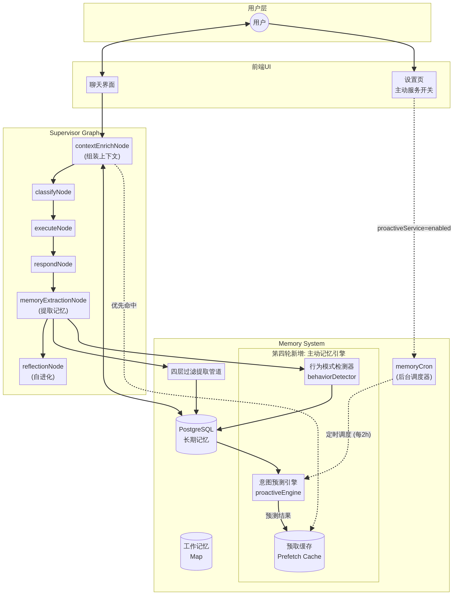

# SmartAgent4 架构设计文档 (第四轮迭代：主动记忆引擎)

**作者**: Manus AI  
**日期**: 2026 年 3 月 30 日  
**状态**: 设计中

---

## 1. 架构概览

本轮迭代的核心目标是将 memU 的**主动记忆引擎（Proactive Memory Engine）**理念融入 SmartAgent4。传统的记忆系统（如第一至第三轮迭代的实现）是被动的：只有当用户发起对话时，系统才会去检索相关记忆。

主动记忆引擎将记忆系统提升为一个能够"思考"和"行动"的主动参与者。它在后台持续运行，监控用户的交互模式，预测用户的下一步需求，并在用户提问之前预先准备好相关的上下文。这种设计能够显著降低响应延迟，并提供更智能、更个性化的对话体验。

为了保持系统的稳定性和解耦，主动记忆能力将作为**旁路增强（Bypass Enhancement）**实现，不修改核心对话管线的拓扑结构。

## 2. 架构图



## 3. 核心组件设计

### 3.1 行为模式检测器 (Behavior Pattern Detector)

**职责**：监控对话流，识别用户的习惯、偏好频率和交互模式。

**位置**：挂接在现有的 `memoryExtractionNode` 之后，作为其异步流程的一部分。

**工作机制**：
1. 接收 `memoryExtractionNode` 提取出的新记忆项（特别是 `behavior` 和 `preference` 类型）。
2. 调用 LLM 分析最近的对话历史和提取的记忆，识别出具有统计意义的模式（例如："用户通常在晚上 10 点后询问技术问题"）。
3. 将识别出的模式持久化到现有的 PostgreSQL `behavior_patterns` 表中。

### 3.2 意图预测引擎 (Intent Prediction Engine)

**职责**：基于用户的长期记忆、行为模式和最近的对话，预测用户下一次可能的意图。

**位置**：由 `memoryCron.ts` 后台调度器定期触发（例如每 2 小时）。

**工作机制**：
1. 检查用户的 `proactiveService` 设置，仅对开启该功能的用户执行预测。
2. 聚合用户的最近会话、高置信度行为模式和核心画像。
3. 调用 LLM 推理："基于这些信息，用户下一次最可能需要什么协助？"
4. 将预测结果（Predicted Intent）和相关搜索查询（Suggested Queries）输出。
5. 根据 Suggested Queries 提前执行 `hybridSearch` 检索记忆。
6. 将检索到的上下文存入**预取缓存（Prefetch Cache）**。

### 3.3 上下文预取缓存 (Context Prefetch Cache)

**职责**：存储提前检索好的记忆上下文，供对话管线快速读取。

**位置**：内存级的键值对存储（Map），带有 TTL（例如 4 小时）。

**工作机制**：
1. 接收来自意图预测引擎的预取结果，以 `userId` 为键进行存储。
2. 当用户发起新对话时，`contextEnrichNode` 首先检查缓存。
3. 如果用户的输入与缓存的预测意图高度相关（缓存命中），则直接使用缓存的上下文，跳过耗时的实时数据库检索。
4. 如果缓存未命中，则降级到常规的实时 `hybridSearch`。

### 3.4 主动服务开关集成 (Proactive Service Integration)

**职责**：将用户在前端界面的设置真正落实到后端逻辑中。

**工作机制**：
1. 数据库 `user_preferences` 表中已存在 `proactiveService` 字段（`enabled`/`disabled`）。
2. `memoryCron.ts` 在执行意图预测前，读取该字段。
3. 如果为 `disabled`，则跳过该用户的预测和预取流程，节省计算资源。

## 4. 数据流设计

### 4.1 被动记忆流（现有）
`User Input` → `contextEnrichNode` (实时检索 DB) → `classify` → `execute` → `respond` → `memoryExtractionNode` (提取事实) → `DB`

### 4.2 主动监控流（新增）
`memoryExtractionNode` → `behaviorDetector` (识别模式) → `behavior_patterns 表`

### 4.3 主动预测流（新增，后台异步）
`memoryCron` (每 2h 触发) → 检查 `proactiveService` 开关 → `proactiveEngine` (读取 DB 记忆与模式) → LLM 预测 → `hybridSearch` (预取) → 写入 `Prefetch Cache`

### 4.4 缓存命中流（新增，加速响应）
`User Input` → `contextEnrichNode` (检查 `Prefetch Cache`) → 命中缓存 → 直接组装 System Prompt → `classify` ...

## 5. 数据库模型利用

本轮迭代无需新增表结构，将充分利用 `drizzle/schema.ts` 中已定义但尚未使用的 `behavior_patterns` 表：

```typescript
export const behaviorPatterns = pgTable("behavior_patterns", {
  id: serial("id").primaryKey(),
  userId: integer("user_id").notNull(),
  patternType: varchar("pattern_type", { length: 50 }).notNull(), // 'schedule', 'communication', 'task'
  description: text("description").notNull(),
  confidence: real("confidence").notNull().default(0.5),
  frequency: integer("frequency").notNull().default(1),
  lastObservedAt: timestamp("last_observed_at").defaultNow(),
  createdAt: timestamp("created_at").defaultNow(),
  updatedAt: timestamp("updated_at").defaultNow(),
});
```

## 6. 风险与缓解

1. **LLM 成本控制**：后台预测任务可能会消耗大量 Token。
   * **缓解**：预测任务的执行频率限制为每 2-4 小时一次；仅对近期有活跃会话（24小时内）且开启了主动服务的用户执行。
2. **缓存失效问题**：预取的上下文可能与用户实际提问无关。
   * **缓解**：在 `contextEnrichNode` 中引入轻量级的相关性校验（如快速的向量相似度计算），如果用户输入与预测意图不符，则放弃缓存，执行实时检索。

## 7. 下一步计划

进入 Phase 3（接口与数据结构定义），详细定义：
- 行为模式检测器的 LLM Prompt 和输出格式
- 意图预测引擎的接口签名和缓存数据结构
- `memoryCron.ts` 和 `contextEnrichNode.ts` 的修改点
