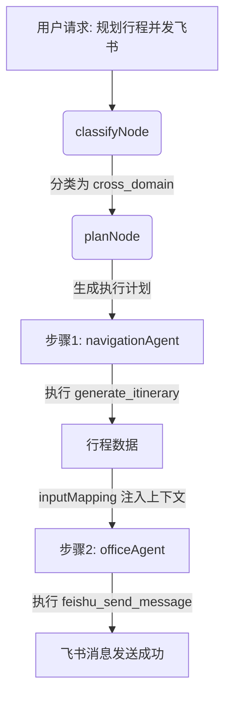

# SmartAgent4 v0.5 第二批迭代架构指南 (CLAUDE.md)

> 面向 AI 编程助手的项目架构浓缩指南
> 版本：v0.5 第二批迭代（Omni 端到端语音、新闻、飞书、行程、订餐、跨域协同）
> 分支：`demo_0423`
> 日期：2026-04-25

## 1. 项目定位

SmartAgent4 是一个面向智能座舱的创新产品 Demo，采用多智能体（Multi-Agent）架构。v0.5 第二批迭代重点落地了**端到端语音大模型（Omni 模式）**和**跨域协同高潮场景**（如：规划行程后自动在飞书拉群发消息），并补充了新闻、飞书、行程、订餐等垂直领域能力。

## 2. 技术栈速查表

| 层级 | 技术/框架 | 说明 |
|---|---|---|
| **前端框架** | React 18 + Vite + TypeScript | 采用组件化开发，TailwindCSS 样式 |
| **状态管理** | Zustand | 全局状态管理（如 `useOmniMode`） |
| **前端通信** | tRPC + WebSocket + SSE | tRPC 处理常规请求，SSE 处理 Supervisor 流式输出，WebSocket 处理 Omni 实时语音 |
| **后端框架** | Express + tRPC | 提供 API 接口和 RPC 服务 |
| **Agent 编排** | LangGraph.js | 基于图的 Agent 工作流编排（Supervisor 模式） |
| **大模型接入** | LangChain.js + DashScope | 文本模型通过 LangChain 接入，Omni 语音模型直连阿里云 DashScope |
| **测试框架** | Vitest + React Testing Library | 支持 node 和 jsdom 双环境测试 |

## 3. 核心处理管线

### 3.1 Omni 模式数据流（前端直连）

```mermaid
graph TD
    A[用户语音输入] -->|麦克风采集| B(OmniRealtimeClient)
    B -->|WebSocket (二进制音频)| C{DashScope Omni API}
    C -->|WebSocket (音频流+文本)| B
    B -->|状态更新| D[Cockpit UI (语音指示器)]
    B -->|音频播放| E[扬声器]
```

*注：Omni 模式在前端进行物理隔离，开启时旁路原有的 ASR -> Supervisor -> TTS 链路。*

### 3.2 跨域协同数据流（Supervisor 编排）



## 4. 模块职责表（第二批迭代新增）

| 模块/文件路径 | 职责说明 |
|---|---|
| `client/src/lib/omniRealtimeClient.ts` | 封装与 DashScope Omni 模型的 WebSocket 实时通信，处理音频采集、发送、接收和播放。 |
| `client/src/hooks/useOmniMode.ts` | 管理 Omni 模式的开关状态，协调 `OmniRealtimeClient` 的生命周期。 |
| `client/src/components/cockpit/ItineraryTimeline.tsx` | 渲染结构化的行程数据，提供可视化的时间轴 UI。 |
| `server/routers/omniTokenRouter.ts` | 提供 `/api/omni/token` 接口，安全地向前端颁发 DashScope 临时 Token。 |
| `server/agent/domains/officeAgent.ts` | 飞书办公协同 Agent，负责处理发消息、建群、建日程等任务。 |
| `server/agent/domains/serviceAgent.ts` | 生活服务 Agent，负责处理餐厅搜索、外卖下单等任务。 |
| `server/agent/tools/newsTools.ts` | 提供 `get_latest_news` 工具（Mock 实现）。 |
| `server/agent/tools/itineraryTools.ts` | 提供 `generate_itinerary` 工具（Mock 实现）。 |
| `server/agent/tools/serviceTools.ts` | 提供 `search_restaurants` 和 `place_order` 工具（Mock 实现）。 |
| `server/agent/tools/feishuTools.ts` | 提供飞书相关的 Mock 工具（发消息、建日程、建群）。 |

## 5. 关键设计决策 (ADR)

### ADR-B1: Omni 模式前端隔离
**决策**：Omni 模式的 WebSocket 连接直接在前端建立，不经过后端 Supervisor 链路。
**原因**：端到端语音模型要求极低的延迟，经过后端中转会增加网络开销和架构复杂度。后端仅负责颁发临时 Token 以保护 API Key。

### ADR-B2: 跨域数据传递复用 inputMapping
**决策**：在跨域协同场景中，复用现有的 `planNode` 的 `inputMapping` 机制，将前置 Agent 的输出注入到后置 Agent 的上下文中。
**原因**：最小化对现有 LangGraph 编排逻辑的侵入，同时通过 System Prompt 强制后置 Agent（如 OfficeAgent）使用注入的上下文数据。

### ADR-B3: 业务工具全面 Mock 化
**决策**：新闻、行程、订餐、飞书等业务工具在 v0.5 Demo 阶段全部采用内置 Mock 实现。
**原因**：确保 Demo 演示时的绝对稳定性和极速响应，避免因外部 API 限制或网络问题导致演示失败。

## 6. 测试信息

- **测试框架**：Vitest
- **运行命令**：`npx vitest run` (全量) 或 `pnpm test`
- **覆盖率**：第二批迭代新增代码的 UTC（用户测试用例）覆盖率达到 100%（67/67）。
- **已知问题**：`server/chat.test.ts` 中有 3 个用例因沙箱环境缺少 MySQL 实例而持续失败，这是基线遗留问题，与本次迭代无关。

## 7. 开发约定（新增 Agent 流程）

如果需要新增一个领域 Agent（例如 `MusicAgent`），请遵循以下标准流程：
1. 在 `server/agent/tools/` 下实现相关工具（优先考虑 Mock）。
2. 在 `server/agent/domains/` 下创建 Agent 类，继承 `BaseAgent`。
3. 在 `server/agent/agent-cards/` 下创建对应的 JSON 配置文件。
4. 在 `server/agent/smartAgentApp.ts` 中注册新 Agent 和工具。
5. 更新 `server/agent/supervisor/classifyNode.ts` 和 `planNode.ts` 的 Prompt，添加新领域的路由规则。
6. 编写对应的单元测试和集成测试，确保工具列表和 Prompt 规则正确。

## 8. 待办事项 (TODO)

- [ ] **真实 API 接入**：将 Mock 的业务工具替换为真实的外部 API 调用（如高德地图、飞书开放平台）。
- [ ] **Omni 模式打断机制**：完善 Omni 模式下的用户语音打断（Barge-in）逻辑。
- [ ] **数据库依赖解耦**：优化测试环境，使用内存数据库或 Mock 解决 `chat.test.ts` 的 MySQL 依赖问题。
- [ ] **前端构建优化**：解决 `pnpm build` 时的 chunk size 警告，进行代码分割。
