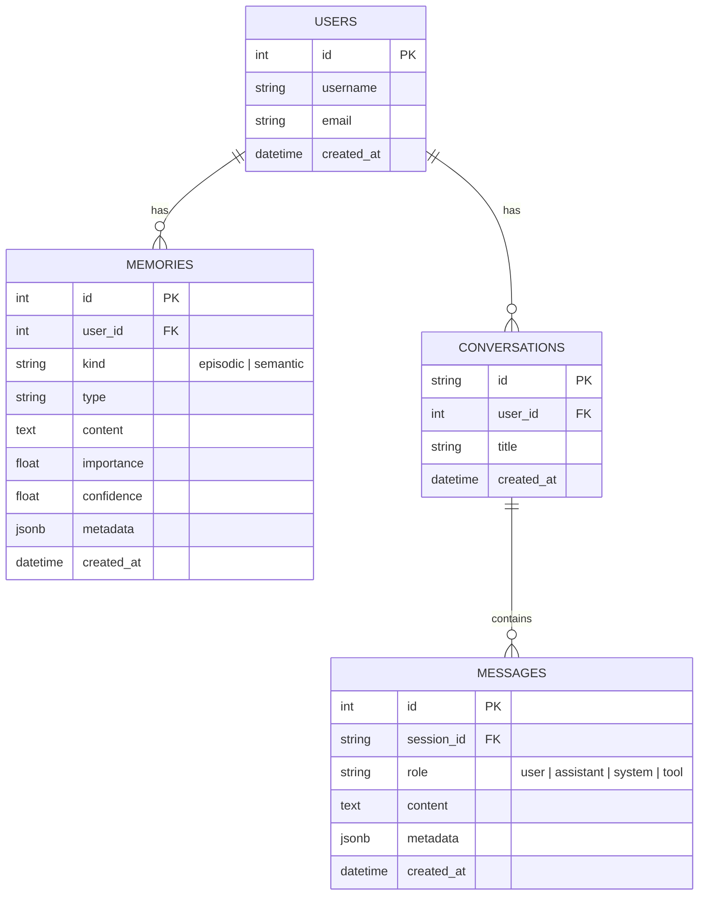

# SmartAgent4 接口与数据结构设计

## 1. 接口规范

### 1.1 记忆提取管道接口 (`server/memory/memorySystem.ts`)

```typescript
/**
 * 记忆提取配置选项
 */
export interface MemoryExtractionOptions {
  /** 是否启用四层过滤机制，默认为 true */
  enableFiltering?: boolean;
  /** 动态去重阈值 (0.0 - 1.0)，默认为 0.85 */
  deduplicationThreshold?: number;
  /** 是否强制要求 LLM 输出时间锚定，默认为 true */
  requireTimeAnchor?: boolean;
}

/**
 * 从对话历史中提取记忆
 * @param userId 用户 ID
 * @param sessionId 会话 ID
 * @param messages 对话历史
 * @param options 提取配置选项
 */
export async function extractMemoriesFromConversation(
  userId: number,
  sessionId: string,
  messages: BaseMessage[],
  options?: MemoryExtractionOptions
): Promise<void>;
```

### 1.2 自进化闭环接口 (`server/agent/supervisor/reflectionNode.ts`)

```typescript
/**
 * 工具效用更新数据
 */
export interface ToolUtilityUpdate {
  toolName: string;
  success: boolean;
  executionTimeMs: number;
  errorMessage?: string;
}

/**
 * Prompt 补丁数据
 */
export interface PromptPatch {
  characterId: string;
  patchContent: string;
  reasoning: string;
}

/**
 * 反思节点状态
 */
export interface ReflectionState {
  sessionId: string;
  taskClassification: TaskClassification;
  plan: PlanStep[];
  executionResults: ToolUtilityUpdate[];
}

/**
 * 异步执行反思与进化
 * @param state 反思节点状态
 */
export async function reflectionNode(state: ReflectionState): Promise<void>;
```

### 1.3 工具注册表扩展接口 (`server/mcp/toolRegistry.ts`)

```typescript
/**
 * 扩展后的注册工具接口
 */
export interface RegisteredTool {
  name: string;
  description: string;
  inputSchema: Record<string, unknown>;
  serverId: string;
  category: ToolCategory;
  registeredAt: Date;
  /** 工具效用分数 (0.0 - 1.0)，默认为 0.5 */
  utilityScore: number;
  /** 成功调用次数 */
  successCount: number;
  /** 失败调用次数 */
  failureCount: number;
  /** 平均执行时间 (ms) */
  avgExecutionTimeMs: number;
}

export interface IToolRegistry {
  // ... 现有方法 ...
  
  /**
   * 更新工具效用统计信息
   * @param update 更新数据
   */
  updateUtility(update: ToolUtilityUpdate): void;
  
  /**
   * 获取按效用分数排序的工具列表
   * @param category 可选的类别过滤
   */
  getRankedTools(category?: ToolCategory): RegisteredTool[];
}
```

## 2. 数据模型图



## 3. 数据库迁移关键变更 (Drizzle Schema)

在 `drizzle/schema.ts` 中，需要将 MySQL 特有的语法替换为 PostgreSQL 语法：

1. **自增主键**：
   - MySQL: `serial("id").primaryKey()`
   - PostgreSQL: `serial("id").primaryKey()` (保持不变，但底层实现不同)

2. **时间戳更新**：
   - MySQL: `timestamp("updated_at").onUpdateNow()`
   - PostgreSQL: 移除 `.onUpdateNow()`，改用数据库触发器或在应用层处理更新时间。

3. **JSON 字段**：
   - MySQL: `json("metadata")`
   - PostgreSQL: `jsonb("metadata")` (推荐使用 `jsonb` 以获得更好的性能和查询能力)

4. **冲突处理 (Upsert)**：
   - MySQL: `onDuplicateKeyUpdate`
   - PostgreSQL: `onConflictDoUpdate`
