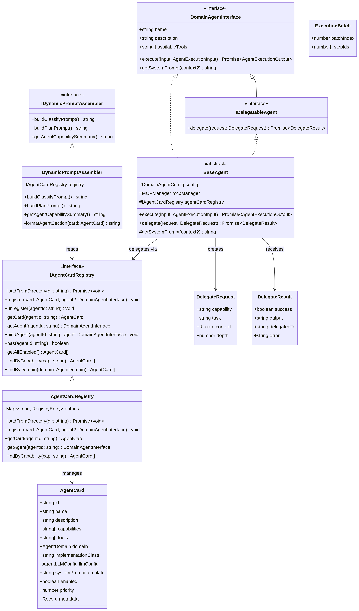

# SmartAgent4 — 接口设计文档 V2

> **版本**：V2（架构解耦迭代）
> **日期**：2026-03-27

## 接口关系总览



## 1. 新增核心数据结构

### 1.1 Agent Card

Agent Card 是每个 Agent 的"身份证"，以 JSON 文件形式存储在 `server/agent/agent-cards/` 目录中。系统启动时由 `AgentCardRegistry` 自动扫描加载。

| 字段 | 类型 | 必填 | 说明 |
|------|------|------|------|
| `id` | `string` | 是 | Agent 唯一标识符（如 `"fileAgent"`） |
| `name` | `string` | 是 | Agent 显示名称（如 `"文件管理专员"`） |
| `description` | `string` | 是 | Agent 能力描述，供 LLM 理解 |
| `capabilities` | `string[]` | 否 | 能力标签列表，用于委托时的能力匹配 |
| `tools` | `string[]` | 否 | 绑定的 MCP 工具名称列表 |
| `domain` | `AgentDomain` | 是 | 领域分类：`file_system` / `navigation` / `multimedia` / `general` / `custom` |
| `implementationClass` | `string` | 是 | Agent 实现类名称 |
| `llmConfig` | `AgentLLMConfig` | 是 | LLM 配置（temperature、maxTokens、maxIterations） |
| `systemPromptTemplate` | `string` | 否 | 系统提示词模板 |
| `enabled` | `boolean` | 否 | 是否启用，默认 `true` |
| `priority` | `number` | 否 | 优先级（0-100），默认 `50` |
| `metadata` | `Record<string, unknown>` | 否 | 扩展元数据 |

### 1.2 ExecutionBatch

DAG 分析后的执行批次，同一批次内的步骤可以并行执行。

| 字段 | 类型 | 说明 |
|------|------|------|
| `batchIndex` | `number` | 批次编号（从 0 开始） |
| `stepIds` | `number[]` | 本批次包含的步骤 ID 列表 |

### 1.3 DelegateRequest / DelegateResult

Agent 间委托的请求和响应数据结构。

| 字段（DelegateRequest） | 类型 | 说明 |
|--------------------------|------|------|
| `capability` | `string` | 需要的能力标签 |
| `task` | `string` | 委托的子任务描述 |
| `context` | `Record<string, unknown>` | 传递给目标 Agent 的上下文 |
| `depth` | `number` | 当前委托深度（防止无限递归） |

| 字段（DelegateResult） | 类型 | 说明 |
|--------------------------|------|------|
| `success` | `boolean` | 委托是否成功 |
| `output` | `string` | 执行结果 |
| `delegatedTo` | `string` | 执行该委托的 Agent ID |
| `error` | `string` | 错误信息（失败时） |
| `toolCalls` | `ToolCallRecord[]` | 工具调用记录 |

## 2. 新增服务接口规范

### 2.1 IAgentCardRegistry

Agent Card 注册表的核心接口，提供 Agent 的生命周期管理和查询能力。

| 方法 | 签名 | 说明 |
|------|------|------|
| `loadFromDirectory` | `(dir: string) => Promise<void>` | 扫描目录加载所有 Agent Card JSON |
| `register` | `(card: AgentCard, agent?: DomainAgentInterface) => void` | 注册单个 Agent Card |
| `unregister` | `(agentId: string) => void` | 注销 Agent |
| `getCard` | `(agentId: string) => AgentCard \| undefined` | 获取 Agent Card |
| `getAgent` | `(agentId: string) => DomainAgentInterface \| undefined` | 获取 Agent 实例 |
| `bindAgent` | `(agentId: string, agent: DomainAgentInterface) => void` | 绑定 Agent 实例 |
| `has` | `(agentId: string) => boolean` | 检查 Agent 是否已注册 |
| `getAllEnabled` | `() => AgentCard[]` | 获取所有已启用的 Agent Card |
| `findByCapability` | `(cap: string) => AgentCard[]` | 按能力标签查找（按优先级降序） |
| `findByDomain` | `(domain: AgentDomain) => AgentCard[]` | 按领域查找 |

### 2.2 IDynamicPromptAssembler

动态 Prompt 组装器接口，运行时生成包含所有已注册 Agent 信息的 LLM Prompt。

| 方法 | 签名 | 说明 |
|------|------|------|
| `buildClassifyPrompt` | `() => string` | 构建分类节点 System Prompt |
| `buildPlanPrompt` | `() => string` | 构建规划节点 System Prompt |
| `getAgentCapabilitySummary` | `() => string` | 获取 Agent 能力摘要文本 |

### 2.3 IDelegatableAgent

可委托的 Agent 接口，扩展 `DomainAgentInterface`。

| 方法 | 签名 | 说明 |
|------|------|------|
| `delegate` | `(request: DelegateRequest) => Promise<DelegateResult>` | 委托子任务给其他 Agent |

### 2.4 并行执行引擎

并行执行引擎的核心函数。

| 函数 | 签名 | 说明 |
|------|------|------|
| `analyzeDependencies` | `(steps: {id, dependsOn}[]) => ExecutionBatch[]` | DAG 拓扑排序，生成执行批次 |
| `createParallelExecuteNode` | `(registry: IAgentCardRegistry) => LangGraphNode` | 创建 LangGraph 兼容的并行执行节点 |
| `resolveInputMapping` | `(mapping, results) => Record<string, unknown>` | 解析步骤间的数据引用 |

## 3. 改造接口（state.ts 变更）

### 3.1 PlanStep.targetAgent 类型变更

```typescript
// 变更前（硬编码联合字面量）
targetAgent: "fileAgent" | "navigationAgent" | "multimediaAgent" | "generalAgent";

// 变更后（动态字符串，运行时通过 AgentCardRegistry 验证）
targetAgent: string;
```

此变更影响 `planNode.ts` 中的 `validAgents` 验证逻辑，需从硬编码数组改为 `registry.getAllIds()`。

## 4. 保留接口（上一轮迭代）

### 4.1 记忆提取管道接口 (`server/memory/memorySystem.ts`)

```typescript
export interface MemoryExtractionOptions {
  enableFiltering?: boolean;
  deduplicationThreshold?: number;
  requireTimeAnchor?: boolean;
}

export async function extractMemoriesFromConversation(
  userId: number,
  sessionId: string,
  messages: BaseMessage[],
  options?: MemoryExtractionOptions
): Promise<void>;
```

### 4.2 自进化闭环接口 (`server/agent/supervisor/reflectionNode.ts`)

```typescript
export interface ToolUtilityUpdate {
  toolName: string;
  success: boolean;
  executionTimeMs: number;
  errorMessage?: string;
}

export interface PromptPatch {
  characterId: string;
  patchContent: string;
  reasoning: string;
}
```

### 4.3 工具注册表扩展接口 (`server/mcp/toolRegistry.ts`)

```typescript
export interface IToolRegistry {
  updateUtility(update: ToolUtilityUpdate): void;
  getRankedTools(category?: ToolCategory): RegisteredTool[];
}
```

## 5. 代码框架文件清单

| 文件路径 | 类型 | 说明 |
|----------|------|------|
| `server/agent/discovery/types.ts` | 类型定义 | 所有新增接口和数据结构 |
| `server/agent/discovery/agentCardRegistry.ts` | 实现 | AgentCardRegistry 完整实现 |
| `server/agent/discovery/dynamicPromptAssembler.ts` | 实现 | DynamicPromptAssembler 完整实现 |
| `server/agent/discovery/parallelExecuteEngine.ts` | 实现 | 并行执行引擎（DAG 分析 + 执行） |
| `server/agent/discovery/index.ts` | 入口 | 模块统一导出 |
| `server/agent/agent-cards/fileAgent.json` | 配置 | FileAgent 的 Agent Card |
| `server/agent/agent-cards/navigationAgent.json` | 配置 | NavigationAgent 的 Agent Card |
| `server/agent/agent-cards/multimediaAgent.json` | 配置 | MultimediaAgent 的 Agent Card |
| `server/agent/agent-cards/generalAgent.json` | 配置 | GeneralAgent 的 Agent Card |

## 6. 错误处理规范

所有新增模块遵循统一的错误处理策略：

| 场景 | 处理方式 |
|------|----------|
| Agent Card JSON 格式不合法 | `AgentCardRegistry.loadFromDirectory()` 记录错误日志，跳过该文件，继续加载其他文件 |
| Agent ID 在注册表中未找到 | `parallelExecuteNode` 返回 `StepResult { status: "error" }` |
| 委托深度超限（默认 3 层） | `BaseAgent.delegate()` 返回 `DelegateResult { success: false, error: "Max delegation depth exceeded" }` |
| 按能力标签未匹配到 Agent | `BaseAgent.delegate()` 返回 `DelegateResult { success: false, error: "No agent found for capability" }` |
| DAG 存在循环依赖 | `analyzeDependencies()` 记录警告，将未处理步骤作为最后一个批次降级串行执行 |
