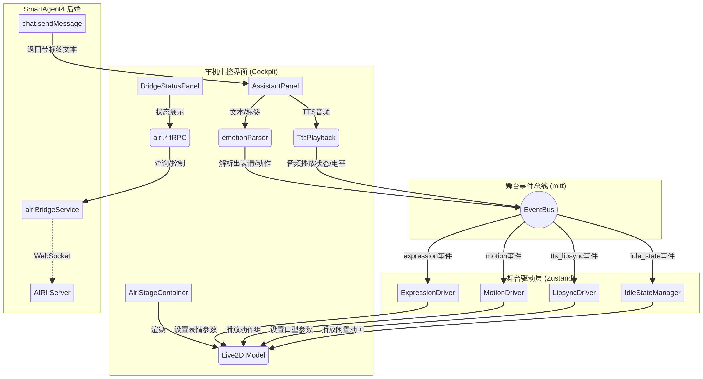

# SmartAgent4 AIRI 前端舞台集成 — 架构设计文档

## 高层架构

本次架构设计的核心思想是**非侵入式扩展**：在不改变现有 `chat.sendMessage` 接口契约和 `AssistantPanel` 文本渲染逻辑的前提下，通过引入一个轻量级的**舞台事件总线（Stage Event Bus）**，将文本中解析出的情感标签和 TTS 播放状态，转化为驱动 Live2D 模型的结构化事件。

## 模块职责

| 模块 | 主要职责 | 技术选型 | 依赖关系 |
|------|----------|----------|----------|
| **AiriStageContainer** | 承载 Live2D 渲染画布，管理模型资源的加载、卸载和自适应缩放。 | React, pixi-live2d-display, PixiJS | 依赖 `StageEventBus` 接收驱动指令 |
| **StageEventBus** | 充当 UI 组件与舞台驱动层之间的解耦中介，分发 `expression`、`motion`、`tts_lipsync` 等事件。 | mitt (轻量级 EventEmitter) | 无 |
| **ExpressionDriver** | 监听表情事件，将情感类型（如 happy）映射为 Live2D 的表情参数（如 `ParamEyeLOpen`、`ParamMouthForm`），并控制平滑过渡。 | Zustand (状态管理) | 依赖 `StageEventBus` |
| **MotionDriver** | 监听动作事件，调用 Live2D 模型的预设动作组（Motion Group），处理动作优先级和打断逻辑。 | Zustand | 依赖 `StageEventBus` |
| **LipsyncDriver** | 监听 TTS 播放状态，利用 Web Audio API 提取音频电平，实时驱动 Live2D 的嘴巴开合参数（`ParamMouthOpenY`）。 | Web Audio API, Zustand | 依赖 `TtsPlayback` 提供的音频源 |
| **IdleStateManager** | 监控舞台空闲时间，当无表情、动作或说话事件时，自动播放呼吸动画和随机眨眼，并处理 thinking/listening 状态。 | Zustand | 依赖 `StageEventBus` |
| **BridgeStatusPanel** | 显示后端 AIRI Bridge 的连接状态，提供手动连接/断开控制。 | React, tRPC | 依赖 `airi.*` tRPC 路由 |

## 数据流场景

### 场景 1：AI 回复触发表情与动作（写操作/驱动流）

1. **入口点**：用户发送消息，后端 `chat.sendMessage` 返回包含情感标签的文本（如 `[expression:smile][animation:nod]你好`）。
2. **解析与分发**：前端 `AssistantPanel` 接收到文本，调用 `emotionParser` 提取出 `smile` 表情和 `nod` 动作。
3. **事件广播**：`AssistantPanel` 将提取出的标签转化为结构化事件，通过 `StageEventBus` 广播 `expression(smile)` 和 `motion(nod)`。
4. **驱动执行**：
   - `ExpressionDriver` 监听到 `smile` 事件，计算对应的 Live2D 参数目标值，并在 requestAnimationFrame 循环中平滑插值更新模型参数。
   - `MotionDriver` 监听到 `nod` 事件，调用 Live2D 模型的 `motion('nod')` 方法播放动作。
5. **状态回归**：动作播放完毕后，`IdleStateManager` 接管控制权，恢复呼吸动画。

### 场景 2：TTS 语音触发口型联动（读操作/音频流）

1. **入口点**：用户点击"生成语音"或系统自动播放 TTS，`TtsPlayback` 组件获取到音频 Base64 数据并转换为 `<audio>` 元素播放。
2. **音频分析**：`LipsyncDriver` 监听到播放开始事件，将 `<audio>` 元素连接到 Web Audio API 的 `AnalyserNode`。
3. **实时驱动**：在音频播放期间，`LipsyncDriver` 每帧读取频域数据计算音量电平（RMS），将其映射为 0.0-1.0 的值。
4. **参数更新**：将计算出的电平值直接赋给 Live2D 模型的 `ParamMouthOpenY` 参数，实现嘴巴随声音张合。
5. **结束清理**：音频播放结束，`LipsyncDriver` 断开音频节点，将嘴巴参数重置为 0，角色退出说话态。

## 设计决策

### 决策 1：采用前端事件总线而非后端直接推送

- **背景**：需要将 AI 的情感输出传递给 Live2D 模型。
- **备选方案**：
  1. 后端通过 WebSocket 直接向前端推送结构化的舞台事件。
  2. 前端复用现有的文本标签解析机制，通过本地事件总线分发。
- **最终决策**：选择方案 2（前端事件总线）。
- **理由**：SmartAgent4 的后端已经将情感标签嵌入在文本中返回，前端 `emotionParser` 也已实现。复用这一机制可以避免修改后端的 `chat.sendMessage` 接口，保持前后端契约的稳定性，同时实现最快的 MVP 闭环。

### 决策 2：使用基于音量电平的简化口型驱动

- **背景**：需要让角色在说话时嘴巴能动起来。
- **备选方案**：
  1. 精确音素级同步（Viseme）：后端 TTS 引擎返回每个音素的时间戳，前端精确控制口型。
  2. 简化音量驱动：前端提取音频播放时的实时音量电平，映射为嘴巴张合度。
- **最终决策**：选择方案 2（简化音量驱动）。
- **理由**：当前使用的 Emotions-System TTS 接口未返回音素时间戳数据。在浏览器端使用 Web Audio API 提取音量电平实现简单、性能开销小，且对于 2D 角色而言，视觉效果已经足够满足"说话"的感知需求。

### 决策 3：状态管理采用 Zustand + 独立 Driver 模式

- **背景**：Live2D 模型的参数控制涉及多个维度的并发更新（表情、动作、口型、呼吸）。
- **备选方案**：
  1. 将所有控制逻辑写在 `AiriStageContainer` 组件内部。
  2. 使用 Redux 集中管理所有舞台状态。
  3. 使用 Zustand 将不同维度的控制逻辑拆分为独立的 Driver Hook。
- **最终决策**：选择方案 3（Zustand + 独立 Driver）。
- **理由**：Live2D 控制逻辑复杂且包含大量 requestAnimationFrame 循环。将其拆分为独立的 Driver（Expression, Motion, Lipsync, Idle）可以极大提高代码可维护性。Zustand 轻量且支持在 React 组件外部读取/更新状态，非常适合这种非 UI 驱动的动画逻辑。

## 可扩展性考虑

1. **多模型支持**：`AiriStageContainer` 设计为接受 `modelUrl` 属性，未来可以轻松支持用户在设置中切换不同的 Live2D 模型。
2. **3D 扩展**：事件总线（Stage Event Bus）的协议设计与具体渲染引擎无关。未来引入 VRM/Three.js 渲染器时，只需替换 Container 和 Driver 层，事件协议可完全复用。
3. **后端直推演进**：如果未来后端实现了流式 WebSocket 推送，只需在前端增加一个 WebSocket 监听器，将接收到的事件直接打入 Stage Event Bus 即可，无需修改驱动层逻辑。

## 安全性考虑

1. **资源加载安全**：Live2D 模型资源（.moc3, 纹理等）应存放在同源服务器或配置了严格 CORS 策略的 CDN 上，防止跨站脚本攻击。
2. **音频处理沙箱**：Web Audio API 的使用遵循浏览器的自动播放策略（Autoplay Policy），必须在用户交互（如点击发送消息或播放按钮）后才能启动音频上下文，避免被浏览器拦截。
