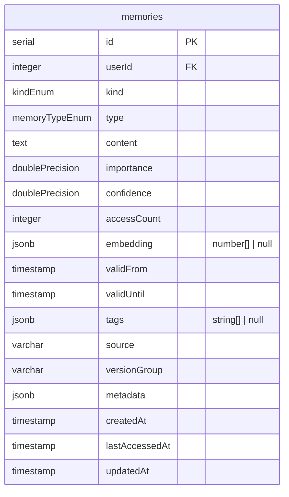
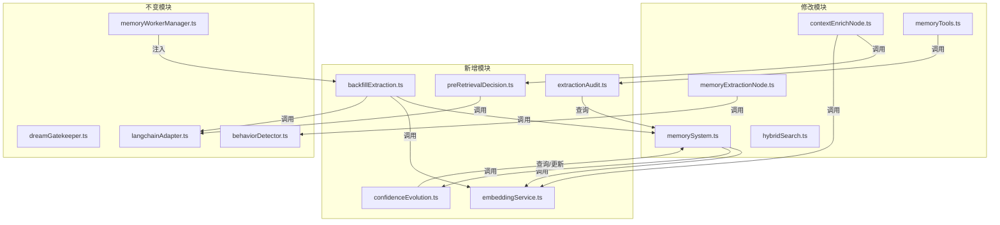

# SmartAgent4 记忆系统优化 — 接口设计文档

**阶段**：第3阶段 — 接口与数据结构定义
**关联文档**：`PRODUCT_SPEC.md`、`docs/MEMORY_OPTIMIZATION_ARCHITECTURE.md`

---

## 1. 概述

本文档定义了记忆系统优化涉及的所有模块的代码级接口契约，包括 5 个新增模块和 5 个修改模块。每个接口定义包含方法签名、输入/输出类型、错误处理约定和使用示例。

所有新增模块的代码框架文件已创建在对应路径下，内部方法标记为 `// TODO: 第4阶段实现`。

---

## 2. 新增模块接口

### 2.1 embeddingService.ts — Embedding 生成服务

**文件路径**：`server/memory/embeddingService.ts`

**配置方式**：通过环境变量或 `initEmbeddingService(config)` 函数配置。

| 环境变量 | 默认值 | 说明 |
|:---|:---|:---|
| `DASHSCOPE_API_KEY` | — | API Key（必需） |
| `EMBEDDING_BASE_URL` | `https://dashscope.aliyuncs.com/compatible-mode/v1` | API 端点 |
| `EMBEDDING_MODEL` | `text-embedding-v3` | 模型名称 |
| `EMBEDDING_DIMENSIONS` | `1024` | 向量维度 |
| `EMBEDDING_TIMEOUT_MS` | `3000` | 超时时间（毫秒） |
| `EMBEDDING_BATCH_SIZE` | `20` | 批量请求每批条数 |

**核心接口**：

```typescript
/** 初始化服务（可选，不调用则使用默认配置） */
function initEmbeddingService(config?: EmbeddingServiceConfig): void;

/** 获取服务实例 */
function getEmbeddingService(): EmbeddingServiceInstance;

/** 生成单条 Embedding（便捷函数） */
async function generateEmbedding(text: string): Promise<number[] | null>;

/** 批量生成 Embedding（便捷函数） */
async function generateEmbeddingBatch(texts: string[]): Promise<BatchEmbeddingResult>;
```

**关键类型**：

```typescript
interface EmbeddingResult {
  embedding: number[] | null;  // 向量，失败时为 null
  tokenUsage: number;          // 消耗的 token 数
  durationMs: number;          // 耗时（毫秒）
}

interface BatchEmbeddingResult {
  embeddings: (number[] | null)[];  // 每条对应的向量
  totalTokenUsage: number;
  successCount: number;
  failureCount: number;
  durationMs: number;
}
```

**错误处理约定**：
- `generateEmbedding` 在任何异常情况下返回 `null`，不抛出异常
- `generateEmbeddingBatch` 中单条失败不影响其他条目，失败条目的 embedding 为 `null`
- 所有异常通过 `console.warn` 记录日志

**调用方**：`memorySystem.ts`（addMemory）、`backfillExtraction.ts`、`contextEnrichNode.ts`（查询向量化）

---

### 2.2 preRetrievalDecision.ts — 检索前决策服务

**文件路径**：`server/memory/preRetrievalDecision.ts`

**核心接口**：

```typescript
/** 主入口：执行完整的 Pre-Retrieval Decision */
async function makePreRetrievalDecision(
  userQuery: string,
  dialogueHistory: DialogueEntry[],
  config?: PreRetrievalConfig
): Promise<PreRetrievalResult>;

/** 规则层快速判断（同步，零延迟） */
function ruleBasedDecision(
  userQuery: string
): { decision: RetrievalDecision; reason: string } | null;

/** LLM 层二分类 + 查询重写 */
async function llmBasedDecision(
  userQuery: string,
  dialogueHistory: DialogueEntry[],
  config?: PreRetrievalConfig
): Promise<{ decision: RetrievalDecision; rewrittenQuery: string | null; reason: string }>;

/** 独立查询重写（规则层判定 RETRIEVE 时使用） */
async function rewriteQuery(
  userQuery: string,
  dialogueHistory: DialogueEntry[],
  config?: PreRetrievalConfig
): Promise<string>;
```

**关键类型**：

```typescript
type RetrievalDecision = "RETRIEVE" | "NO_RETRIEVE";
type DecisionSource = "rule" | "llm";

interface PreRetrievalResult {
  decision: RetrievalDecision;
  source: DecisionSource;
  rewrittenQuery: string | null;  // 仅 RETRIEVE 时有值
  reason: string;
  durationMs: number;
}

interface DialogueEntry {
  role: "user" | "assistant";
  content: string;
}
```

**决策流程**：

```
用户输入 → ruleBasedDecision()
  ├─ 命中闲聊模式 → NO_RETRIEVE（source=rule）
  ├─ 命中记忆模式 → RETRIEVE（source=rule）→ rewriteQuery()
  └─ 不确定 → llmBasedDecision()
       ├─ NO_RETRIEVE（source=llm）
       └─ RETRIEVE + rewrittenQuery（source=llm）
```

**错误处理约定**：
- LLM 调用失败时降级为 `RETRIEVE`（宁可多检索，不可漏检索）
- 查询重写失败时返回原始查询
- 超时时间通过 `PreRetrievalConfig.llmTimeoutMs` 控制

**调用方**：`contextEnrichNode.ts`

---

### 2.3 extractionAudit.ts — 提取审计层

**文件路径**：`server/memory/extractionAudit.ts`

**核心接口**：

```typescript
/** 主入口：执行完整的提取审计 */
async function auditMemoryExtraction(
  input: AuditInput,
  config?: AuditConfig
): Promise<AuditResult>;

/** 重要性门控检查 */
function checkImportanceGate(importance: number, threshold?: number): boolean;

/** Jaccard 相似度计算 */
function computeJaccardSimilarity(textA: string, textB: string): number;

/** 去重校验 */
function checkDeduplication(
  input: AuditInput,
  existingMemories: Memory[],
  threshold?: number
): { matchedMemory: Memory; similarityScore: number } | null;
```

**关键类型**：

```typescript
type AuditVerdict = "PASS" | "REJECT" | "MERGE";
type RejectReason = "low_importance" | "duplicate_content" | "missing_required_fields";

interface AuditResult {
  verdict: AuditVerdict;
  rejectReason?: RejectReason;
  matchedMemory?: Memory;
  similarityScore?: number;
  feedbackMessage: string;  // 面向 Agent 的反馈
}

interface AuditInput {
  userId: number;
  content: string;
  type: "fact" | "behavior" | "preference" | "emotion";
  kind?: "episodic" | "semantic" | "persona";
  importance: number;
  confidence?: number;
  versionGroup?: string;
  tags?: string[];
}
```

**配置项**：

| 环境变量 | 默认值 | 说明 |
|:---|:---|:---|
| `AUDIT_IMPORTANCE_THRESHOLD` | `0.3` | 重要性门控阈值 |
| `AUDIT_DEDUP_THRESHOLD` | `0.6` | Jaccard 去重阈值 |
| `AUDIT_DEDUP_SEARCH_LIMIT` | `50` | 去重查询的记忆数量上限 |

**审计流程**：

```
AuditInput → 字段校验
  ├─ 缺少必填字段 → REJECT(missing_required_fields)
  └─ 通过 → 重要性门控
       ├─ importance < 0.3 → REJECT(low_importance)
       └─ 通过 → 去重校验
            ├─ Jaccard > 0.6 → REJECT(duplicate_content) 或 MERGE
            └─ 通过 → PASS
```

**调用方**：`memoryTools.ts`（memoryStoreImpl）

---

### 2.4 confidenceEvolution.ts — Confidence 演化服务

**文件路径**：`server/memory/confidenceEvolution.ts`

**核心接口**：

```typescript
/** 主入口：执行 Confidence 演化 */
async function evolveConfidence(
  newMemory: {
    content: string;
    kind?: string;
    versionGroup?: string;
    userId: number;
  },
  existingMemories: Memory[],
  config?: EvolutionConfig
): Promise<EvolutionResult>;

/** 判断内容关系 */
function judgeContentRelation(
  newContent: string,
  existingContent: string,
  threshold?: number
): "consistent" | "contradictory";

/** 计算置信度提升值 */
function calculateBoostIncrement(
  currentConfidence: number,
  accessCount: number,
  config?: EvolutionConfig
): number;
```

**关键类型**：

```typescript
type EvolutionAction = "BOOST" | "SUPERSEDE" | "NO_MATCH" | "SKIP";

interface EvolutionResult {
  action: EvolutionAction;
  affectedMemory?: Memory;
  previousConfidence?: number;
  newConfidence?: number;
  reason: string;
}
```

**配置项**：

| 环境变量 | 默认值 | 说明 |
|:---|:---|:---|
| `CONFIDENCE_BOOST_INCREMENT` | `0.15` | 置信度提升增量上限 |
| `CONFIDENCE_MAX` | `1.0` | 置信度上限 |
| `CONFIDENCE_SUPERSEDE_PENALTY` | `0.2` | 矛盾时的降低增量 |
| `CONFIDENCE_MIN` | `0.1` | 置信度下限 |
| `CONFIDENCE_CONSISTENCY_THRESHOLD` | `0.5` | 内容一致性 Jaccard 阈值 |

**演化流程**：

```
新记忆 → 检查 kind
  ├─ kind=persona → SKIP
  └─ 其他 → 查询同 versionGroup 的已有记忆
       ├─ 无匹配 → NO_MATCH（正常写入）
       └─ 有匹配 → judgeContentRelation()
            ├─ 一致 → BOOST（提升已有记忆 confidence，跳过写入）
            └─ 矛盾 → SUPERSEDE（降低已有记忆 confidence，继续写入）
```

**调用方**：`memorySystem.ts`（addMemory 内部）

---

### 2.5 backfillExtraction.ts — 补漏提取服务

**文件路径**：`server/memory/backfillExtraction.ts`

**核心接口**：

```typescript
/** 主入口：执行补漏提取 */
async function executeBackfillExtraction(
  userId: number,
  config?: BackfillConfig
): Promise<BackfillResult>;

/** 从对话中提取记忆候选 */
async function extractMemoryCandidates(
  conversations: Array<{ role: string; content: string }>,
  config?: BackfillConfig
): Promise<ExtractedMemoryCandidate[]>;

/** 去重校验 */
function deduplicateCandidates(
  candidates: ExtractedMemoryCandidate[],
  existingMemories: Memory[],
  threshold?: number
): ExtractedMemoryCandidate[];

/** 创建 MemoryWorkerManager 兼容的执行器 */
function createBackfillExecutor(
  config?: BackfillConfig
): (request: MemoryWorkerRequest) => Promise<MemoryWorkerResponse>;
```

**关键类型**：

```typescript
interface BackfillResult {
  extractedCount: number;
  deduplicatedCount: number;
  writtenCount: number;
  failedCount: number;
  memoryIds: number[];
  durationMs: number;
}

interface ExtractedMemoryCandidate {
  content: string;
  type: "fact" | "behavior" | "preference" | "emotion";
  kind: "episodic" | "semantic" | "persona";
  importance: number;
  confidence: number;
  versionGroup?: string;
  tags?: string[];
}
```

**配置项**：

| 环境变量 | 默认值 | 说明 |
|:---|:---|:---|
| `BACKFILL_MAX_TURNS` | `20` | 回溯的最大对话轮数 |
| `BACKFILL_DEDUP_THRESHOLD` | `0.6` | 去重 Jaccard 阈值 |
| `BACKFILL_MAX_MEMORIES` | `10` | 单次提取最大记忆条数 |
| `BACKFILL_LLM_TIMEOUT_MS` | `10000` | LLM 调用超时 |

**调用方**：`memoryWorkerManager.ts`（通过 `createBackfillExecutor` 注入）

---

## 3. 修改模块接口变更

### 3.1 memorySystem.ts — addMemory 集成 Embedding 生成

**变更描述**：在 `addMemory` 函数中，写入数据库前调用 `embeddingService.generateEmbedding` 生成向量，并填充 `embedding` 字段。采用 await 模式 + 超时降级（设计决策 1）。

**变更前签名**（不变）：

```typescript
async function addMemory(memory: InsertMemory): Promise<Memory | null>;
```

**内部变更**：

```typescript
// 变更前：直接插入
const result = await db.insert(memories).values(memory).returning();

// 变更后：先生成 embedding，再插入
import { generateEmbedding } from "./embeddingService";

const embedding = await generateEmbedding(memory.content);
const memoryWithEmbedding = { ...memory, embedding };
const result = await db.insert(memories).values(memoryWithEmbedding).returning();
```

**新增依赖**：`embeddingService.ts`

**对外接口不变**：调用方无需修改，`InsertMemory` 类型已包含可选的 `embedding` 字段。

---

### 3.2 memorySystem.ts — searchMemories 默认启用混合检索

**变更描述**：修改 `getFormattedMemoryContext` 中对 `searchMemories` 的调用，传入查询的 embedding 向量以启用真正的向量检索。

**变更前**：

```typescript
const hybrid = await searchMemories({
  userId,
  query: q,
  limit: 15,
  minImportance: 0.25,
  useHybridSearch: true,
  // queryEmbedding 未传入 → 向量路径无效
});
```

**变更后**：

```typescript
import { generateEmbedding } from "./embeddingService";

const queryEmbedding = await generateEmbedding(q);
const hybrid = await searchMemories({
  userId,
  query: q,
  queryEmbedding,  // 传入查询向量
  limit: 15,
  minImportance: 0.25,
  useHybridSearch: true,
});
```

**新增依赖**：`embeddingService.ts`

---

### 3.3 contextEnrichNode.ts — 插入 Pre-Retrieval Decision

**变更描述**：在调用 `getFormattedMemoryContext` 之前，插入 Pre-Retrieval Decision 判断。若决策为 `NO_RETRIEVE`，跳过记忆检索。若决策为 `RETRIEVE`，使用重写后的查询进行检索。

**变更位置**：`contextEnrichNode` 函数中 `Promise.all` 之前

**变更逻辑**：

```typescript
import { makePreRetrievalDecision } from "../../memory/preRetrievalDecision";

// 在 prefetchCache 检查之后、记忆检索之前插入
if (!prefetchHit) {
  // 构建对话历史
  const dialogueHistory = messages
    .filter(m => m._getType() === "human" || m._getType() === "ai")
    .slice(-10)
    .map(m => ({
      role: m._getType() === "human" ? "user" as const : "assistant" as const,
      content: typeof m.content === "string" ? m.content : JSON.stringify(m.content)
    }));

  const preRetrieval = await makePreRetrievalDecision(userText, dialogueHistory);

  console.log(
    `[ContextEnrichNode] Pre-Retrieval Decision: ${preRetrieval.decision} ` +
    `(source=${preRetrieval.source}, ${preRetrieval.durationMs}ms)`
  );

  if (preRetrieval.decision === "NO_RETRIEVE") {
    // 跳过记忆检索，仅构建基础 System Prompt
    // ...（降级逻辑）
    return { dynamicSystemPrompt: fallbackPrompt, retrievedMemories: [] };
  }

  // 使用重写后的查询替代原始查询
  const effectiveQuery = preRetrieval.rewrittenQuery || userText;
  // 后续使用 effectiveQuery 进行检索
}
```

**新增依赖**：`preRetrievalDecision.ts`

---

### 3.4 memoryTools.ts — memoryStoreImpl 集成审计层

**变更描述**：在 `memoryStoreImpl` 中，调用 `addMemory` 之前先执行 `auditMemoryExtraction`。若审计拒绝，直接返回反馈信息给 Agent。

**变更位置**：`memoryStoreImpl` 函数中参数校验之后、`addMemory` 调用之前

**变更逻辑**：

```typescript
import { auditMemoryExtraction } from "../../memory/extractionAudit";

// 参数校验通过后，执行审计
const auditResult = await auditMemoryExtraction({
  userId,
  content: content.trim(),
  type,
  kind,
  importance,
  confidence,
  versionGroup,
  tags,
});

if (auditResult.verdict === "REJECT") {
  return `记忆写入被审计拦截：${auditResult.feedbackMessage}`;
}

if (auditResult.verdict === "MERGE" && auditResult.matchedMemory) {
  // 合并到已有记忆
  await updateMemory(auditResult.matchedMemory.id, {
    content: content.trim(),
    importance: Math.max(importance, auditResult.matchedMemory.importance),
  });
  return `记忆已合并到已有记忆 ID: ${auditResult.matchedMemory.id}（相似度: ${auditResult.similarityScore?.toFixed(2)}）`;
}

// verdict === "PASS"，继续原有的 addMemory 流程
```

**新增依赖**：`extractionAudit.ts`

---

### 3.5 memoryExtractionNode.ts — 解耦行为模式检测

**变更描述**：将行为模式检测从"自动提取成功后触发"改为基于工作记忆中的对话计数独立触发。无论 `AUTO_EXTRACTION_ENABLED` 是否开启，都在达到对话轮数阈值（默认 10 轮）时异步触发行为检测。

**新增状态**：模块级的对话计数器（按 userId 维度）

```typescript
/** 每个用户的对话轮数计数器 */
const userDialogueCounters = new Map<number, number>();

/** 行为检测触发阈值（对话轮数） */
const BEHAVIOR_DETECTION_THRESHOLD = parseInt(
  process.env.BEHAVIOR_DETECTION_THRESHOLD ?? "10",
  10
);
```

**变更逻辑**：

```typescript
// 在工作记忆更新之后，自动提取判断之前
const currentCount = (userDialogueCounters.get(userId) || 0) + 1;
userDialogueCounters.set(userId, currentCount);

if (currentCount >= BEHAVIOR_DETECTION_THRESHOLD) {
  console.log(
    `[MemoryExtractionNode] Dialogue count ${currentCount} >= ${BEHAVIOR_DETECTION_THRESHOLD}, ` +
    `triggering behavior detection for user ${userId}`
  );
  userDialogueCounters.set(userId, 0); // 重置计数器

  // 异步触发行为检测（fire-and-forget）
  detectAndPersistPatterns({
    userId,
    conversationHistory,
    extractedMemories: [],
    timestamp: new Date().toISOString(),
  }).catch((err) => {
    console.error(
      "[MemoryExtractionNode] Behavior detection failed:",
      (err as Error).message
    );
  });
}
```

**新增依赖**：无（`detectAndPersistPatterns` 已导入）

---

### 3.6 hybridSearch.ts — embedding 为空时的优雅降级

**变更描述**：在 `hybridSearch` 函数中，当 `queryEmbedding` 为空或所有候选记忆的 `embedding` 均为空时，自动将 alpha 调整为 1.0（纯 BM25 模式），避免向量路径产生全零分数影响排序。

**变更位置**：`hybridSearch` 函数开头

**变更逻辑**：

```typescript
export function hybridSearch(options: HybridSearchOptions): HybridSearchResult[] {
  let { query, queryEmbedding, candidates, limit = 10, alpha = 0.5 } = options;

  if (candidates.length === 0) return [];

  // 优雅降级：无查询向量或无文档向量时，退化为纯 BM25
  const hasQueryEmbedding = queryEmbedding && queryEmbedding.length > 0;
  const hasAnyDocEmbedding = candidates.some(
    (c) => (c as any).embedding && ((c as any).embedding as number[]).length > 0
  );

  if (!hasQueryEmbedding || !hasAnyDocEmbedding) {
    console.log(
      `[HybridSearch] Degrading to BM25-only: ` +
      `queryEmbedding=${hasQueryEmbedding}, docEmbeddings=${hasAnyDocEmbedding}`
    );
    alpha = 1.0; // 纯 BM25
  }

  // ... 后续逻辑不变
}
```

**新增依赖**：无

---

## 4. 数据模型

### 4.1 现有数据模型（不变）

数据库 schema 不做任何修改。`memories` 表的 `embedding` 字段（`jsonb`，`number[] | null`）已满足需求。



### 4.2 新增环境变量汇总

| 环境变量 | 默认值 | 所属模块 | 说明 |
|:---|:---|:---|:---|
| `EMBEDDING_BASE_URL` | `https://dashscope.aliyuncs.com/compatible-mode/v1` | embeddingService | Embedding API 端点 |
| `EMBEDDING_MODEL` | `text-embedding-v3` | embeddingService | Embedding 模型名称 |
| `EMBEDDING_DIMENSIONS` | `1024` | embeddingService | 向量维度 |
| `EMBEDDING_TIMEOUT_MS` | `3000` | embeddingService | 超时时间 |
| `EMBEDDING_BATCH_SIZE` | `20` | embeddingService | 批量请求每批条数 |
| `AUDIT_IMPORTANCE_THRESHOLD` | `0.3` | extractionAudit | 重要性门控阈值 |
| `AUDIT_DEDUP_THRESHOLD` | `0.6` | extractionAudit | 去重 Jaccard 阈值 |
| `AUDIT_DEDUP_SEARCH_LIMIT` | `50` | extractionAudit | 去重查询上限 |
| `CONFIDENCE_BOOST_INCREMENT` | `0.15` | confidenceEvolution | 置信度提升增量 |
| `CONFIDENCE_MAX` | `1.0` | confidenceEvolution | 置信度上限 |
| `CONFIDENCE_SUPERSEDE_PENALTY` | `0.2` | confidenceEvolution | 矛盾降低增量 |
| `CONFIDENCE_MIN` | `0.1` | confidenceEvolution | 置信度下限 |
| `CONFIDENCE_CONSISTENCY_THRESHOLD` | `0.5` | confidenceEvolution | 一致性 Jaccard 阈值 |
| `BACKFILL_MAX_TURNS` | `20` | backfillExtraction | 回溯最大对话轮数 |
| `BACKFILL_DEDUP_THRESHOLD` | `0.6` | backfillExtraction | 补漏去重阈值 |
| `BACKFILL_MAX_MEMORIES` | `10` | backfillExtraction | 单次提取最大条数 |
| `BACKFILL_LLM_TIMEOUT_MS` | `10000` | backfillExtraction | LLM 超时 |
| `BEHAVIOR_DETECTION_THRESHOLD` | `10` | memoryExtractionNode | 行为检测触发轮数 |

---

## 5. 模块依赖关系



---

## 6. 代码框架文件清单

| 文件路径 | 状态 | 说明 |
|:---|:---|:---|
| `server/memory/embeddingService.ts` | ✅ 已创建 | 类型定义完成，方法体待实现 |
| `server/memory/preRetrievalDecision.ts` | ✅ 已创建 | 类型定义完成，方法体待实现 |
| `server/memory/extractionAudit.ts` | ✅ 已创建 | 类型定义完成，方法体待实现 |
| `server/memory/confidenceEvolution.ts` | ✅ 已创建 | 类型定义完成，方法体待实现 |
| `server/memory/backfillExtraction.ts` | ✅ 已创建 | 类型定义完成，方法体待实现 |

---

## 7. 第4阶段实现优先级

基于模块依赖关系，建议的实现顺序：

1. **embeddingService.ts** — 无外部依赖，是其他模块的基础
2. **extractionAudit.ts** — 仅依赖 memorySystem 的查询能力
3. **confidenceEvolution.ts** — 依赖 memorySystem 和 embeddingService
4. **memorySystem.ts 变更** — 集成 embeddingService 和 confidenceEvolution
5. **preRetrievalDecision.ts** — 依赖 langchainAdapter
6. **contextEnrichNode.ts 变更** — 集成 preRetrievalDecision 和 embeddingService
7. **memoryTools.ts 变更** — 集成 extractionAudit
8. **memoryExtractionNode.ts 变更** — 独立变更，无新依赖
9. **hybridSearch.ts 变更** — 独立变更，无新依赖
10. **backfillExtraction.ts** — 依赖 memorySystem 和 embeddingService
