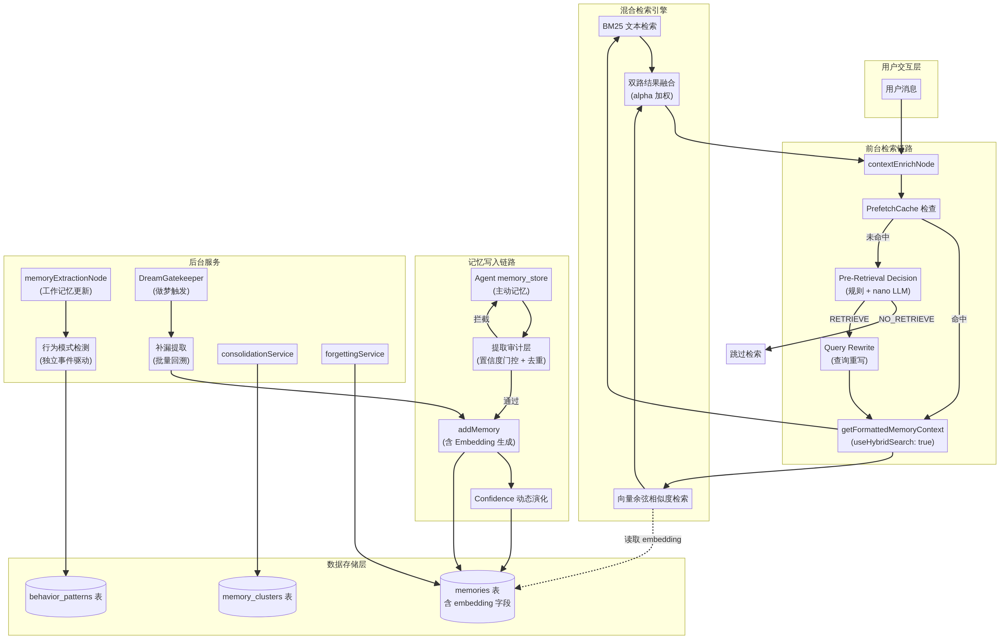

# SmartAgent4 记忆系统优化 — 架构设计文档

## 高层架构

本次优化涉及 SmartAgent4 记忆系统的三大链路：**前台检索链路**、**记忆写入链路**和**后台服务链路**。优化不改变现有的 Supervisor 图编排结构，而是在现有节点和模块内部进行能力增强和流程插入。

架构图源文件：`diagrams/memory_optimization_architecture.mmd`

## 模块职责

### 新增模块

| 模块 | 文件路径 | 主要职责 | 技术选型 | 依赖关系 |
|:---|:---|:---|:---|:---|
| Embedding 生成服务 | `server/memory/embeddingService.ts` | 调用 OpenAI Embedding API 将文本转为向量；提供批量回填能力；失败时优雅降级 | OpenAI text-embedding-3-small | OpenAI SDK |
| Pre-Retrieval Decision | `server/memory/preRetrievalDecision.ts` | 判断用户查询是否需要触发记忆检索；规则快速判断 + nano LLM 二分类；同时输出查询重写结果 | 规则引擎 + gpt-4.1-nano | OpenAI SDK |
| 提取审计层 | `server/memory/extractionAudit.ts` | 在 Agent 调用 `memory_store` 时执行置信度门控和去重校验；拦截低质量和重复记忆 | Jaccard 相似度 | memorySystem.ts |
| Confidence 演化服务 | `server/memory/confidenceEvolution.ts` | 在记忆写入和更新时，根据已有记忆的匹配情况动态调整置信度 | versionGroup 匹配 + 语义相似度 | memorySystem.ts, embeddingService.ts |
| 补漏提取服务 | `server/memory/backfillExtraction.ts` | 在做梦机制触发时，对最近未被提取的对话进行批量回溯提取 | LLM 提取 + 去重 | memorySystem.ts, embeddingService.ts |

### 修改模块

| 模块 | 文件路径 | 修改内容 | 依赖变更 |
|:---|:---|:---|:---|
| memorySystem.ts | `server/memory/memorySystem.ts` | `addMemory` 中集成 Embedding 生成；`searchMemories` 中默认启用混合检索 | 新增依赖 embeddingService.ts |
| contextEnrichNode.ts | `server/agent/supervisor/contextEnrichNode.ts` | 插入 Pre-Retrieval Decision 判断；启用混合检索；使用重写后的查询 | 新增依赖 preRetrievalDecision.ts |
| memoryTools.ts | `server/agent/tools/memoryTools.ts` | `memory_store` 中集成提取审计层 | 新增依赖 extractionAudit.ts |
| memoryExtractionNode.ts | `server/agent/supervisor/memoryExtractionNode.ts` | 解耦行为模式检测触发条件；基于对话计数独立触发 | 无新增依赖 |
| hybridSearch.ts | `server/memory/hybridSearch.ts` | 增加 embedding 为空时的优雅降级逻辑 | 无新增依赖 |

### 不变模块

| 模块 | 文件路径 | 说明 |
|:---|:---|:---|
| consolidationService.ts | `server/memory/consolidationService.ts` | 固化服务保持不变，本次不涉及语义聚类增强（P2） |
| forgettingService.ts | `server/memory/forgettingService.ts` | 遗忘服务保持不变 |
| proactiveEngine.ts | `server/memory/proactiveEngine.ts` | 主动引擎保持不变 |
| dreamGatekeeper.ts | `server/memory/worker/dreamGatekeeper.ts` | 门控逻辑不变，仅注入补漏提取执行器 |
| memoryWorkerManager.ts | `server/memory/worker/memoryWorkerManager.ts` | 工作管理器不变，仅注入补漏提取执行器 |
| schema.ts | `drizzle/schema.ts` | 数据库 schema 不变，`embedding` 字段已存在 |

## 数据流场景

### 场景 1：写操作 — 用户信息被记忆（含 Embedding 生成 + 审计 + 置信度演化）

1. **入口点**：Agent 在多轮对话后判断需要记录用户信息，调用 `memory_store` 工具。
2. **提取审计**：`extractionAudit.ts` 接收写入请求，执行两项检查：（a）重要性门控 — 若 `importance < 0.3`，拦截并返回警告；（b）去重校验 — 查询同一用户的已有记忆，计算 Jaccard 相似度，若超过阈值 0.6 则拦截或触发合并。
3. **Confidence 演化**：`confidenceEvolution.ts` 查询同一 `versionGroup` 的已有记忆。若内容一致，提升已有记忆的置信度（增量 ≤ 0.15，上限 1.0），并跳过写入。若内容矛盾，降低已有记忆的置信度，继续写入新记忆。
4. **Embedding 生成**：`addMemory` 调用 `embeddingService.ts` 异步生成向量。生成成功后更新 `embedding` 字段；失败时记录警告日志，`embedding` 保持为 null。
5. **数据存储**：记忆写入 `memories` 表，包含完整的结构化字段和 embedding 向量。
6. **返回响应**：向 Agent 返回存储成功的确认信息，包含记忆 ID。

### 场景 2：读操作 — 用户查询触发记忆检索（含 Pre-Retrieval Decision + 查询重写 + 混合检索）

1. **入口点**：用户发送消息，系统进入 `contextEnrichNode`。
2. **PrefetchCache 检查**：首先检查预取缓存是否命中。若命中，直接使用缓存的格式化上下文，跳过后续步骤。
3. **Pre-Retrieval Decision**：若缓存未命中，调用 `preRetrievalDecision.ts`。规则层首先检查：若用户输入匹配闲聊模式（问候、感谢、纯表情等），直接返回 `NO_RETRIEVE`。若规则层无法确定，调用 gpt-4.1-nano 进行二分类，同时输出查询重写结果。
4. **查询重写**：若决策为 `RETRIEVE`，使用重写后的查询（消解代词、补充上下文）替代原始查询。若 Pre-Retrieval Decision 通过规则判断为 RETRIEVE（无 LLM 调用），则单独调用一次 nano LLM 进行查询重写。
5. **混合检索**：`getFormattedMemoryContext` 以 `useHybridSearch: true` 调用 `searchMemories`。`hybridSearch.ts` 同时执行 BM25 文本检索和向量余弦相似度检索，通过 alpha 加权融合双路结果。若某条记忆的 embedding 为空，该记忆仅参与 BM25 路径。
6. **返回响应**：格式化的记忆上下文被注入到 Supervisor 状态中，供后续节点使用。

### 场景 3：后台操作 — 行为模式检测（独立事件驱动）

1. **入口点**：`memoryExtractionNode` 在每轮对话结束后执行。
2. **工作记忆更新**：始终将用户消息和最终回复追加到工作记忆中。
3. **对话计数检查**：检查工作记忆中累积的对话轮数。若达到阈值（默认 10 轮），异步触发行为模式检测。
4. **行为检测**：`detectAndPersistPatterns` 分析最近的对话历史，识别时间规律、话题偏好、沟通风格等行为模式。
5. **数据存储**：检测到的行为模式写入 `behavior_patterns` 表。
6. **重置计数**：对话计数器重置为 0，等待下一轮累积。

### 场景 4：后台操作 — 做梦补漏提取

1. **入口点**：`DreamGatekeeper` 检测到消息数或时间达到做梦阈值。
2. **触发做梦**：`MemoryWorkerManager.startDream` 被调用，分配任务 ID。
3. **补漏提取**：`backfillExtraction.ts` 作为执行器被调用。它查询最近 N 轮未被 Agent 主动记录的对话，调用 LLM 提取管道进行批量提取。
4. **去重校验**：提取结果与已有记忆进行去重校验，过滤重复项。
5. **写入记忆**：通过 `addMemory`（含 Embedding 生成）写入新记忆。
6. **任务完成**：`MemoryWorkerManager` 发出 `dreamCompleted` 事件，更新统计信息。

## 设计决策

### 决策 1：Embedding 生成采用异步模式

- **背景**：记忆写入是对话流程中的关键路径，不能因 Embedding API 的延迟而阻塞用户体验。
- **备选方案**：
  - 方案 A：同步生成 — 在 `addMemory` 中同步等待 Embedding API 返回。优点是数据一致性强；缺点是增加写入延迟 100-300ms。
  - 方案 B：异步生成 — 先写入记忆（embedding 为 null），然后异步生成并更新。优点是不阻塞写入；缺点是短暂窗口内新记忆无法被向量检索命中。
  - 方案 C：异步生成 + await 模式 — 在 `addMemory` 内部发起异步请求，但在返回前 await 结果，失败时降级。
- **最终决策**：方案 C — 异步生成 + await 模式，配合超时降级。
- **理由**：方案 C 在大多数情况下能保证写入时即有 embedding（API 响应通常 < 200ms），同时通过超时机制（如 3 秒）避免极端情况下的阻塞。相比方案 B，避免了"写入后立即检索找不到"的时间窗口问题。

### 决策 2：Pre-Retrieval Decision 采用"规则 + LLM"混合路径

- **背景**：需要在检索前快速判断是否需要触发记忆检索，但纯规则无法覆盖所有场景，纯 LLM 则延迟过高。
- **备选方案**：
  - 方案 A：纯规则 — 使用正则和关键词匹配。优点是零延迟；缺点是覆盖率低，容易误判。
  - 方案 B：纯 LLM — 每次都调用 LLM 判断。优点是准确率高；缺点是增加 300-500ms 延迟。
  - 方案 C：规则 + LLM 混合 — 规则层快速处理明确场景，不确定时调用 LLM。
- **最终决策**：方案 C — 规则 + LLM 混合路径。
- **理由**：实测中约 30-40% 的查询可被规则层直接判断（明显的闲聊或明显的记忆查询），剩余 60-70% 才需要 LLM 介入。这种分层设计在准确率和延迟之间取得了最佳平衡。

### 决策 3：查询重写与 Pre-Retrieval Decision 合并为一次 LLM 调用

- **背景**：查询重写和检索决策都需要理解对话上下文，如果分开调用会产生两次 LLM 延迟。
- **备选方案**：
  - 方案 A：两次独立调用 — 先判断是否检索，再重写查询。延迟叠加。
  - 方案 B：合并为一次调用 — 在同一个 Prompt 中同时输出决策和重写结果。
- **最终决策**：方案 B — 合并为一次 LLM 调用。
- **理由**：两个任务的输入上下文完全相同（对话历史 + 当前查询），合并后仅增加少量输出 token，但节省了一次完整的 API 调用延迟。当规则层已判定为 RETRIEVE 时，仍需单独调用一次 LLM 进行查询重写。

### 决策 4：提取审计层放在 memoryTools 层而非 memorySystem 层

- **背景**：需要在 Agent 写入记忆时进行质量把控，但审计逻辑的放置位置会影响其他写入路径。
- **备选方案**：
  - 方案 A：放在 `memorySystem.addMemory` 中 — 所有写入路径都经过审计。
  - 方案 B：放在 `memoryTools.memoryStoreImpl` 中 — 仅 Agent 主动写入经过审计。
- **最终决策**：方案 B — 放在 memoryTools 层。
- **理由**：审计的目标是防止 Agent 写入低质量记忆，而服务端兜底写入（如导航情景）和补漏提取已经有各自的质量控制机制。如果放在 `addMemory` 中，可能会干扰这些已经过验证的写入路径。此外，审计拦截后需要向 Agent 返回可理解的反馈信息，这在 Tools 层更容易实现。

### 决策 5：行为模式检测基于对话轮数而非时间间隔触发

- **背景**：需要将行为检测从自动提取中解耦，选择新的触发条件。
- **备选方案**：
  - 方案 A：基于时间间隔（如每 30 分钟）。
  - 方案 B：基于对话轮数（如每 10 轮）。
  - 方案 C：基于消息内容变化（如检测到新话题）。
- **最终决策**：方案 B — 基于对话轮数。
- **理由**：行为模式的识别需要足够的对话样本量。基于轮数触发能确保每次检测都有足够的数据支撑，而基于时间间隔可能在用户不活跃时浪费资源，或在用户高频对话时样本不足。方案 C 虽然更精细，但实现复杂度过高，不适合当前迭代。

## 可扩展性考虑

本次架构设计在以下方面预留了扩展空间：

**Embedding 模型可替换**：`embeddingService.ts` 封装了 Embedding API 的调用细节，未来可以替换为本地模型（如 sentence-transformers）或其他云服务，只需修改服务实现而不影响调用方。

**Pre-Retrieval Decision 可扩展**：规则层和 LLM 层的判断逻辑是独立的，未来可以增加更多规则（如基于用户历史行为的判断），或替换为更精准的分类模型。

**审计层可配置**：重要性阈值（0.3）和去重阈值（0.6）均设计为可配置参数，可以根据实际运行数据进行调优。

**后台任务可插拔**：补漏提取作为 `MemoryWorkerManager` 的执行器注入，未来可以按照相同模式注入更多后台任务（如语义聚类固化、预测模型更新等）。

## 安全性考虑

**API Key 保护**：Embedding API 和 LLM 调用使用环境变量中的 `OPENAI_API_KEY`，不在代码中硬编码。

**用户数据隔离**：所有记忆操作都基于 `userId` 进行隔离，确保不同用户的记忆不会交叉污染。审计层和置信度演化都在用户维度内执行。

**降级安全**：所有新增的 API 调用（Embedding、LLM）都设计了超时和降级机制，确保外部服务故障不会导致核心对话流程中断。
