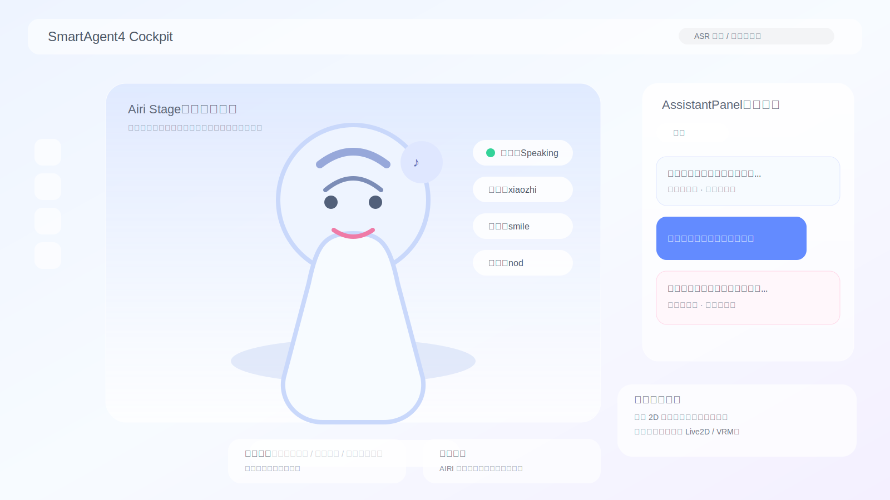

# SmartAgent4 中 AIRI 形象 Web 展示可行性评估

**作者：Manus AI**  
**日期：2026-04-12**

## 一、结论摘要

基于当前仓库实现，我的结论是：**项目中已经存在 AIRI 的后端接入与运行桥接代码，但并不存在可直接在当前浏览器界面中渲染 AIRI 形象的前端部署代码、模型资源或渲染依赖**。换言之，当前代码库已经具备“把 SmartAgent4 的文本、情绪、语音结果转发给外部 AIRI Runtime”的基础，但还没有具备“在现有 Web 页面内直接显示一个可动的 AIRI 角色”的完整前端展示层。

如果你的目标是**先在现在这套 Web 座舱里把 AIRI 形象同时展示出来，看整体效果是否成立**，那么答案是：**可行，而且可分为低、中、高三档实现路径**。其中最低成本的方案不需要真正接入 Live2D/VRM 渲染，只要在当前座舱中部新增一个“角色舞台区”，复用现有 `characterId`、情绪标签和 TTS 状态，就能做出一个已经很接近产品形态的预览版。若你希望的是“真正能动、能切表情、甚至跟外部 AIRI Runtime 同步动作”的版本，则仍然可行，但需要补齐前端渲染层与角色资源层。

## 二、项目里现在到底有没有 AIRI 部署代码

从后端结构看，仓库中已经存在一个明确的 `server/airi-bridge` 模块。它的职责不是在浏览器中渲染角色，而是作为 **SmartAgent4 与外部 AIRI Server Runtime 之间的 WebSocket Bridge**。`airiBridgeService.ts` 中已经实现了连接、认证、模块注册、心跳、输入监听与输出转发等逻辑；其注释也明确写明，该服务负责监听 AIRI 侧输入事件，把输入转发给 SmartAgent4 的聊天接口，再把 SmartAgent4 的输出转成 AIRI 可消费的输出消息。这说明仓库里确实已经有“接入 AIRI 生态”的部署基础，但它属于**运行时桥接层**，并不是**浏览器角色展示层**。

进一步看配置层，`server/airi-bridge/config.ts` 与 `config/airi-bridge.json` 体现的是一个典型的外部运行时接入方式：通过 WebSocket 地址、自动连接、自动重连、默认角色 ID、情绪映射和 TTS 开关来控制 Bridge 行为。这里能看到情绪与动作的映射配置，但**看不到任何前端模型资源路径、角色贴图路径、Live2D/VRM 配置、Canvas/WebGL 视图配置**。这进一步证明现阶段项目里虽然有 AIRI 的接入逻辑，却没有“把 AIRI 形象嵌进当前 Web 页”的完整前端实现。

`emotionMapper.ts` 也给出了一个很重要的信号。它已经把 SmartAgent4 的多模态情绪片段映射为 AIRI 所需的 `expression`、`motion`、`audio` 与 `text` 等输出字段。这意味着**现有系统已经具备足够好的角色驱动语义层**，只是**还缺一个前端角色呈现器**去消费这些字段。因此，从架构角度看，当前缺的不是“角色控制语义”，而是“角色舞台渲染器”和“角色资源”。

## 三、当前 Web 结构是否适合把 AIRI 形象一起展示出来

从前端页面结构看，当前 `Cockpit.tsx` 的布局非常适合增加一个角色展示区。页面右侧已经有固定宽度约 `380px` 的 `AssistantPanel`，底部还有一组固定卡片区，左侧则是纵向功能按钮，而中间大面积区域目前主要承担主视觉与中控承载作用。也就是说，**当前页面的中部和中左部本来就存在一个天然可用的“角色舞台区”**，并不需要推翻现有布局。

更重要的是，前端组件层面已经提前具备了几个非常关键的“角色化钩子”。`AssistantPanel.tsx` 里已经存在 `characterId`、`onCharacterChange`，而且还内置了 `xiaozhi`、`jarvis`、`alfred` 等角色切换选项；同一组件还会解析情绪标签，并将回复转成主情绪和动作标签可视化展示。换言之，**当前 UI 已经在“语义上承认存在不同角色”和“回复会携带情绪状态”**。这对于挂载 AIRI 形象非常关键，因为你无需从零发明角色协议，直接把这些既有字段向中间舞台区投射即可。

下表可以概括“当前已有能力”和“缺失能力”的边界。

| 维度 | 当前状态 | 说明 | 对 Web 展示 AIRI 的意义 |
| --- | --- | --- | --- |
| 后端 Bridge | 已有 | 已可连接外部 AIRI Runtime，转发输入输出 | 可作为未来真实驱动层 |
| 情绪语义 | 已有 | 已有情绪解析、情绪标签、emotion mapping | 可直接驱动表情与动作态 |
| 角色选择 | 已有 | 前端已有 `characterId` 与角色切换 UI | 可作为形象切换入口 |
| TTS 流程 | 已有 | 助手消息支持语音合成与播放 | 可与口型/说话状态联动 |
| 前端角色渲染器 | 缺失 | 无 Live2D/VRM/Canvas 角色组件 | 无法直接显示动态 AIRI |
| 角色资源文件 | 缺失 | 未见模型、贴图、动作资源 | 无法还原真实 AIRI 视觉 |
| 渲染依赖 | 缺失 | `package.json` 未见 three、vrm、pixi、live2d 等依赖 | 说明未进入前端角色化实现阶段 |

## 四、能不能在“现在的 Web 形式”里把 AIRI 形象展示出来

答案分两层。

第一层，如果你说的“展示出来”是指**让用户在当前座舱页面里看到一个代表 AIRI 的角色位，并且能随角色切换、情绪变化、TTS 状态发生视觉响应**，那么这是**完全可行**的，而且工程阻力不大。这个版本甚至不要求真实的 Live2D 或 3D 角色，只需要一个 2D 角色立绘、一个状态机和一个舞台组件，就能在视觉上形成“右侧是对话，中央是 AIRI 角色反馈”的完整体验。

第二层，如果你说的“展示出来”是指**在当前 Web 页面里直接运行一个真正的 AIRI 虚拟形象，支持动态表情、动作、说话状态，甚至与外部 Runtime 实时同步**，那也不是不行，但这时仓库现状还不够。需要至少补上以下三类能力：其一是前端渲染引擎，例如 Live2D 或 VRM 的浏览器渲染栈；其二是角色资源，包括模型、动作、表情和贴图；其三是浏览器舞台与 Bridge 之间的事件同步协议。

## 五、建议的三档落地路线

### 方案 A：低成本“先看效果”版

如果你的核心诉求是**先看产品效果，而不是先把完整角色运行时搭起来**，那么最推荐先做这一版。它的思路是在 `Cockpit` 中央主区域增加一个 `AiriStage` 组件，展示一张角色立绘或半身图，再用已有的 `characterId`、情绪解析结果和 TTS 状态去控制三个最基础的 UI 状态：闲置、说话、情绪变化。

这个方案的优势是，你几乎不用动当前后端主流程。前端只需要从现有消息流中拿到最近一条助手消息，解析出主情绪，再根据是否正在播报 TTS 切换角色状态即可。视觉上可以做成轻量动态：例如说话时角色外圈呼吸、情绪变更时立绘浮层切换颜色、播放语音时嘴部区域做简单闪烁或节奏条动画。虽然它不是“真正的 AIRI Runtime 形象”，但对你评估“当前 Web 里同时放角色是否协调、是否占空间、是否有产品感”已经足够。

### 方案 B：中成本“Web 舞台 + Bridge 状态同步”版

这一路线的目标是把当前已有的 `airi-bridge` 真正纳入前端体验。做法是保留 Web 页面中的 `AiriStage`，但让它不再只依赖前端本地情绪解析，而是直接消费后端统一下发的角色状态，例如 `characterId`、`expression`、`motion`、`speaking`、`audioLevel`、`connectionStatus` 等字段。这样，前端舞台和 AIRI Bridge 会形成真正的一致状态。

这一版仍然可以先不用 Live2D 或 VRM，只要做一个可视化舞台组件即可。但它的好处是**架构对齐更强**。后续你一旦替换掉前端舞台的表现层，把“图片切换”升级成“模型动画”，整个协议层和上游逻辑都不用重做。

### 方案 C：高成本“真实 AIRI 形象内嵌”版

如果你的目标是**把真正的 AIRI 数字形象直接内嵌到当前 Web**，那么这已经不是简单的 UI 挂件，而是一次完整的前端数字人接入工程。此时需要明确选择技术路线：如果 AIRI 提供的是 Live2D 资源，就要走 Pixi/Live2D 方向；如果提供的是 VRM 或 glTF 资源，则要走 Three.js/VRM 方向。你还需要补全浏览器端动画状态机、口型同步、资源懒加载、性能控制和移动端降级策略。

该方案的可行性没有问题，但从当前仓库状态看，它**不是“已有 80%，只差开关”的状态**，而是“已经有上游语义驱动层，但浏览器角色层尚未开始建设”的状态。

## 六、最适合当前项目的推荐方案

如果站在你现在这个项目的节奏上，我建议优先采用 **A + B 的组合路径**。也就是说，第一步先在当前 `Cockpit` 页面中加入一个中部角色舞台区，用 2D 方式快速验证效果；第二步再把这个舞台的状态数据改成统一消费后端 Bridge/会话层输出，而不是只从前端消息临时解析。

这样的好处在于，**你可以先验证视觉布局与交互节奏是否成立，再决定是否值得进入真实数字人渲染阶段**。因为从产品演进逻辑上看，最容易失败的往往不是 Live2D 技术接不进去，而是“角色放进来以后，页面是否拥挤、用户是否会觉得干扰、角色反馈是否真的增强了对话体验”。这些问题，用方案 A 就能很快验证。

## 七、建议新增的前端状态字段

为了让当前系统从“有 AIRI Bridge”走向“有 AIRI Web 形象”，建议在会话 UI 层抽出一个统一的角色展示状态对象。最小字段建议如下。

| 字段名 | 类型 | 示例 | 作用 |
| --- | --- | --- | --- |
| `characterId` | string | `xiaozhi` | 标识当前角色 |
| `displayMode` | string | `portrait` / `live2d` / `vrm` | 指示舞台渲染模式 |
| `expression` | string | `neutral` / `smile` / `sad` | 角色表情 |
| `motion` | string | `idle` / `nod` / `wave` | 角色动作 |
| `speaking` | boolean | `true` | 当前是否处于播报/说话态 |
| `audioLevel` | number | `0.0 ~ 1.0` | 口型或声波反馈强度 |
| `lastUtterance` | string | 最近一句回复 | 供舞台字幕或状态联动 |
| `emotionSource` | string | `parsed_message` / `airi_bridge` | 标识状态来源 |
| `connectionStatus` | string | `disconnected` / `ready` | Bridge 或 Runtime 状态 |
| `assetVersion` | string | `airi-v1` | 角色资源版本管理 |

当这些字段被统一后，前端展示层就能与后端 Bridge 解耦。也就是说，不管你后面最终展示的是静态立绘、分层 2D、Live2D，还是 VRM，都只是在替换舞台的渲染器，而不是重写整个系统。

## 八、页面布局上的具体建议

从当前座舱页面尺寸分布看，最合适的方案不是把 AIRI 放进右侧消息面板，而是把它放在**中部偏左区域**，让右侧继续承担“解释和控制”，中部承担“角色与状态呈现”，底部承担“会话与记忆”。这样视觉层次最清晰，也最符合现在代码里的布局惯性。

建议的结构如下表所示。

| 区域 | 当前功能 | 建议变化 |
| --- | --- | --- |
| 顶部 | 输入与主状态栏 | 基本保持不变 |
| 左侧 | 功能快捷入口 | 基本保持不变 |
| 中部偏左 | 当前为空间主视觉区 | 新增 `AiriStage` 角色舞台 |
| 右侧 | `AssistantPanel` 消息与人格切换 | 保持为文本与控制面板 |
| 底部 | 会话管理与记忆卡片 | 保持不变，避免挤压角色区 |

这种结构有一个额外优点：如果未来你做成真实数字人，角色舞台依旧能沿用同一布局，不会影响当前消息面板和底部卡片逻辑。

## 九、我对“想看下效果”的直接判断

如果你现在只是想验证“把 AIRI 形象放进这套 Web，会不会看起来成立”，那么我认为**非常值得做一个轻量预览版**。因为当前项目已经具备角色切换、情绪识别、语音播报和外部 AIRI Bridge 的四项基础条件，缺的只是把这些条件变成一个“舞台化的视觉组件”。这是一个很适合用一两个迭代快速验证的方向。

但如果你的期待是“仓库里应该已经有 AIRI 的浏览器部署代码，只要开关一下就能展示真实形象”，那结论是否定的。当前仓库并不是这个状态。它更像是：**后端协议层已经为 AIRI 准备好了，前端形象层还没有真正开始。**

## 十、建议你接下来怎么做

如果你愿意，我建议下一步直接做一个 **AiriStage 的 Web 预览版**。这个预览版不必一步到位接真实模型，而是先在现有 `Cockpit` 页面里增加一个角色舞台，让它先根据 `characterId`、情绪标签和 TTS 播放状态动起来。这样你就能非常直观地判断：当前信息密度下加入 AIRI 是否提升体验，角色位放在中部是否顺手，是否需要重排右侧面板宽度。

如果你后续确认这个方向有效，再进入第二阶段，把 `airi-bridge` 的输出状态统一收束成前端角色状态协议；最后再决定是否值得接入真实的 Live2D 或 VRM 渲染方案。

---

## 附：AIRI Web 同屏效果示意图

下图不是仓库现有界面的真实截图，而是根据当前 `Cockpit` 布局给出的**最小可行效果示意**。它表达的是：右侧仍保留文本助手面板，中间新增 AIRI 角色舞台，底部卡片保持不变，从而形成“角色 + 对话 + 记忆”的三层协同。

